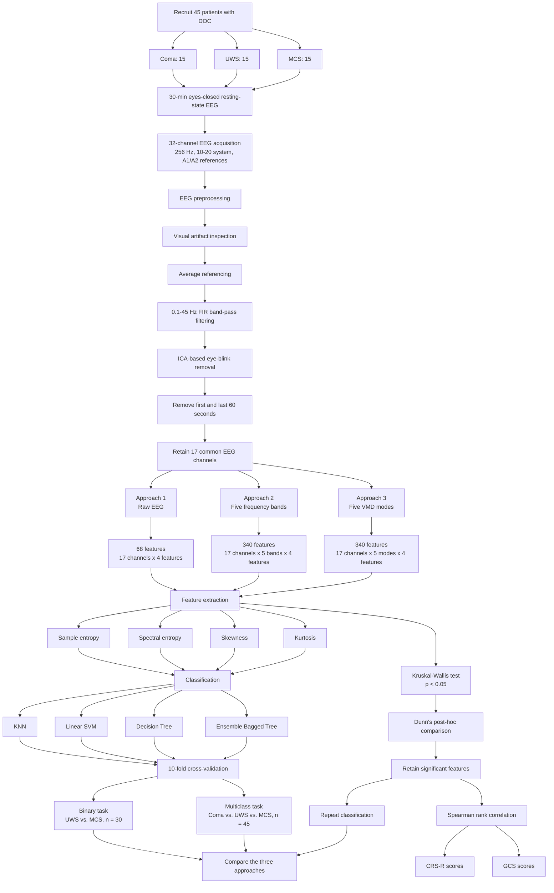

# information

|  |  |
|---|---|
| Title | Variational Mode Decomposition-Based EEG Analysis for the Classification of Disorders of Consciousness |
| Author | Sreelakshmi Raveendran, Raghavendra Kenchaiah, Santhos Kumar, Jayakrushna Sahoo, M. K. Farsana, Ravindranadh Chowdary Mundlamuri, Sonia Bansal, V. S. Binu, A. G. Ramakrishnan, Subasree Ramakrishnan, and S. Kala |
| Journal | Frontiers in Neuroscience |
| Year | 2024 |
| DOI | [10.3389/fnins.2024.1340528](https://doi.org/10.3389/fnins.2024.1340528) |

# abstract

> Aberrant alterations in any of the two dimensions of consciousness, namely awareness and arousal, can lead to the emergence of disorders of consciousness (DOC). The development of DOC may arise from more severe or targeted lesions in the brain, resulting in widespread functional abnormalities. However, when it comes to classifying patients with disorders of consciousness, particularly utilizing resting-state electroencephalogram (EEG) signals through machine learning methods, several challenges surface. The non-stationarity and intricacy of EEG data present obstacles in understanding neuronal activities and achieving precise classification. To address these challenges, this study proposes variational mode decomposition (VMD) of EEG before feature extraction along with machine learning models. By decomposing preprocessed EEG signals into specified modes using VMD, features such as sample entropy, spectral entropy, kurtosis, and skewness are extracted across these modes. The study compares the performance of the features extracted from VMD-based approach with the frequency band-based approach and also the approach with features extracted from raw-EEG. The classification process involves binary classification between unresponsive wakefulness syndrome (UWS) and the minimally conscious state (MCS), as well as multi-class classification (coma vs. UWS vs. MCS). Kruskal-Wallis test was applied to determine the statistical significance of the features and features with a significance of p < 0.05 were chosen for a second round of classification experiments. Results indicate that the VMD-based features outperform the features of other two approaches, with the ensemble bagged tree (EBT) achieving the highest accuracy of 80.5% for multi-class classification (the best in the literature) and 86.7% for binary classification. This approach underscores the potential of integrating advanced signal processing techniques and machine learning in improving the classification of patients with disorders of consciousness, thereby enhancing patient care and facilitating informed treatment decision-making.

意识由觉醒程度和意识知晓程度两个维度构成,其中任一维度出现异常,都可能导致意识障碍(disorders of consciousness, DOC). 意识障碍通常由严重或特定部位的脑损伤引起,并可能造成广泛的脑功能异常. 然而,使用机器学习方法分析静息态脑电图信号并对意识障碍患者进行分类仍然面临多项挑战. 脑电信号具有非平稳性和较高的复杂性,这使神经活动的解释和精确分类变得困难. 为解决这一问题,本研究提出在特征提取之前对脑电信号进行变分模态分解(variational mode decomposition, VMD),并将分解结果与机器学习模型结合. 研究人员将预处理后的脑电信号分解为若干指定模态,并从不同模态中提取样本熵,频谱熵,峰度和偏度特征. 研究比较了三种方法的分类表现,分别是基于VMD模态的特征,基于传统频段的特征,以及直接从原始脑电信号中提取的特征. 分类任务包括无反应觉醒综合征(UWS)与最低意识状态(MCS)之间的二分类,以及昏迷,UWS和MCS之间的三分类. 研究使用Kruskal-Wallis检验评估特征的统计显著性,并选择满足 \(p<0.05\) 的特征进行第二轮分类实验. 结果表明,基于VMD的特征整体优于另外两种方法. 集成装袋决策树模型在三分类任务中取得80.5%的最高准确率,并在二分类任务中取得86.7%的准确率. 该方法表明,将先进的信号分解技术与机器学习相结合,可能有助于提高意识障碍患者的分类准确性,从而辅助临床评估,治疗决策和患者管理.

# workflow

The study included 45 patients, with 15 patients in each of the coma, UWS, and MCS groups. Thirty minutes of eyes-closed resting-state EEG were recorded at 256 Hz. After visual artifact inspection, average referencing, band-pass filtering, ICA-based eye-blink removal, time trimming, and channel selection, 17 common EEG channels were retained for analysis.

研究共纳入45名意识障碍患者,其中昏迷,UWS和MCS各15人. 研究采集了每位患者30分钟的闭眼静息态脑电信号,采样率为256 Hz. 经过人工伪迹检查,平均参考,带通滤波,基于ICA的眼动伪迹去除,首尾时间段裁剪和通道筛选后,最终保留17个所有患者均具备的脑电通道.

The preprocessed signals were analyzed using three parallel representations: raw EEG, five conventional frequency bands, and five VMD modes. The same four features were extracted under each representation and evaluated with KNN, linear SVM, decision tree, and ensemble bagged tree classifiers. The authors first evaluated all features and then repeated the experiments after retaining only statistically significant features.

预处理后的信号通过三条平行路径进行分析: 原始脑电,五个传统频段和五个VMD模态. 三种路径均提取相同的四类特征,并使用KNN,线性SVM,决策树和集成装袋决策树进行分类. 作者首先使用全部特征进行实验,随后保留具有统计显著性的特征并重复分类过程.

# core method

## Why use VMD?

The central idea of the paper is to replace rigid, manually defined EEG frequency bands with a data-adaptive signal decomposition. Conventional EEG analysis divides a signal into fixed delta, theta, alpha, beta, and gamma bands. This method is intuitive and physiologically interpretable, but it assumes that the same frequency boundaries are suitable for every patient and every period of the recording.

这篇论文的核心思想,是使用数据自适应的信号分解方法替代边界固定的传统脑电频段分析. 传统脑电分析通常按照预先定义的范围,将信号划分为delta,theta,alpha,beta和gamma频段. 这种方法直观且具有一定的生理可解释性,但它默认相同的频率边界适用于所有患者和所有记录时段.

Resting-state EEG from patients with disorders of consciousness is highly non-stationary. Its dominant frequencies, amplitudes, and transient patterns may change over time, while brain injury can also produce substantial differences between patients. A fixed band-pass filter may divide related neural activity between two adjacent bands or combine physiologically different components within one band. VMD attempts to reduce this problem by estimating oscillatory modes directly from the structure of the observed signal.

意识障碍患者的静息态脑电具有明显的非平稳性. 信号的主要频率,振幅和瞬态模式可能随时间变化,不同患者的脑损伤也会造成较大的个体差异. 固定带通滤波可能将相关的神经活动分散到两个相邻频段,也可能将生理意义不同的成分合并在同一个频段中. VMD则直接根据观测信号的结构估计振荡模态,以减少固定频率边界带来的限制.

## Variational mode decomposition

For an EEG signal \(x(t)\), VMD assumes that the original signal can be reconstructed as the sum of \(K\) oscillatory modes:

\[
x(t)=\sum_{k=1}^{K}u_k(t)
\]

Each mode \(u_k(t)\) has a corresponding center frequency \(\omega_k\). VMD jointly estimates the modes and their center frequencies by minimizing the total bandwidth of all modes:

\[
\min_{\{u_k\},\{\omega_k\}}
\sum_{k=1}^{K}
\left\|
\partial_t
\left[
\left(
\delta(t)+\frac{j}{\pi t}
\right)
*u_k(t)
\right]
e^{-j\omega_k t}
\right\|_2^2
\]

subject to the reconstruction constraint:

\[
\sum_{k=1}^{K}u_k(t)=x(t)
\]

对于脑电信号 \(x(t)\),VMD假设原始信号可以表示为 \(K\) 个振荡模态的叠加. 每个模态 \(u_k(t)\) 对应一个中心频率 \(\omega_k\). 优化目标是使所有模态的总带宽尽可能小,同时要求所有模态相加后能够重构原始信号.

In practical terms, the algorithm repeatedly updates each mode and its center frequency. The decomposition continues until the estimated modes converge. The optimization is solved using the alternate direction method of multipliers. In this study, the number of modes was fixed at five, the penalty factor was set to \(\alpha=2000\), the noise-tolerance parameter was set to zero, and the center frequencies were initialized uniformly.

从实际计算过程看,VMD会反复更新每个模态及其中心频率,直到分解结果收敛. 该优化问题通过交替方向乘子法求解. 在这项研究中,作者将模态数量固定为5,将惩罚因子设置为 \(\alpha=2000\),将噪声容忍参数设置为0,并对中心频率进行均匀初始化.

Unlike conventional EEG bands, the five VMD modes are not directly assigned predefined physiological ranges. Their frequency content is determined by the input signal itself. This allows the decomposition to adapt to the individual spectral structure of each EEG recording, although it also makes the physiological interpretation of each mode less straightforward than that of traditional frequency bands.

与传统脑电频段不同,这五个VMD模态没有被直接指定为固定的生理频率范围. 每个模态所包含的频率成分由输入信号自身决定. 这种方法能够适应不同脑电记录的个体频谱结构,但与传统频段相比,每个模态的生理意义也更加难以直接解释.

## Feature extraction

After decomposition, four features were extracted from each channel and each VMD mode. Sample entropy measures temporal irregularity and unpredictability. Spectral entropy measures how evenly signal power is distributed across frequencies. Skewness describes the asymmetry of the amplitude distribution, while kurtosis reflects the presence of sharp peaks, heavy tails, and transient activity.

完成分解后,研究从每个通道的每个VMD模态中提取四种特征. 样本熵用于衡量信号在时间维度上的不规则性和不可预测性. 频谱熵用于描述信号功率在不同频率上的分散程度. 偏度反映振幅分布的不对称性,峰度则反映尖峰,厚尾分布和瞬态活动.

The entropy features are particularly relevant to disorders of consciousness. A more complex and less regular EEG is generally associated with richer neural dynamics, whereas highly regular or low-complexity activity may indicate a more severely impaired state. In the raw-EEG analysis, the MCS group generally showed higher sample entropy and spectral entropy than the coma and UWS groups.

熵特征与意识障碍具有较强的理论联系. 更复杂且更不规则的脑电信号通常代表更加丰富的神经动态,而高度规则或复杂度较低的活动可能对应更加严重的意识受损状态. 在原始脑电分析中,MCS组的样本熵和频谱熵整体高于昏迷组和UWS组.

With 17 channels, five modes, and four features, the VMD representation produced \(17\times5\times4=340\) variables for each patient. The frequency-band approach also produced 340 variables, while the raw-EEG approach produced \(17\times4=68\) variables. Extracting the same four features from each representation allowed the authors to focus the comparison on the signal-processing method itself.

研究包含17个通道,每个通道分解为5个模态,每个模态提取4种特征,因此VMD路径为每名患者生成 \(17\times5\times4=340\) 个变量. 传统频段路径同样生成340个变量,而原始脑电路径生成 \(17\times4=68\) 个变量. 三条路径使用相同的四种特征,使作者能够将比较重点放在信号表示和分解方法本身.

## Controlled comparison

An important strength of the study is its controlled comparison. The VMD, frequency-band, and raw-EEG approaches used the same patients, preprocessing steps, statistical features, classifiers, and cross-validation strategy. The major difference among the three experimental branches was therefore the representation of the EEG signal before feature extraction.

这项研究的一个重要优点是进行了相对受控的比较. VMD,传统频段和原始脑电三条路径使用相同的患者,预处理步骤,统计特征,分类器和交叉验证方案. 因此,三个实验分支之间的主要差异是特征提取之前的脑电信号表示方法.

The higher performance of the VMD features suggests that class-related information may be diluted when the signal is analyzed directly or divided into fixed frequency intervals. By isolating narrower, data-driven oscillatory components, VMD may expose transient or non-stationary patterns that are more useful for distinguishing coma, UWS, and MCS.

VMD特征取得更高的分类性能,说明与意识状态有关的信息在直接分析原始信号或使用固定频段划分时可能被混合或削弱. VMD通过分离带宽更窄且由数据驱动的振荡成分,可能揭示出更适合区分昏迷,UWS和MCS的瞬态或非平稳模式.

## Statistical feature selection

The authors used the Kruskal-Wallis test to identify features that differed significantly among patient groups. This non-parametric test is suitable for EEG features because they frequently violate the normal-distribution assumptions required by parametric statistical tests. Features with \(p<0.05\) were retained, and Dunn's post-hoc test was used for further group comparisons.

作者使用Kruskal-Wallis检验识别在不同患者组之间存在显著差异的特征. 这是一种非参数检验,适合处理通常不满足正态分布假设的脑电特征. 作者保留 \(p<0.05\) 的特征,并进一步使用Dunn事后检验进行组间比较.

Removing non-significant variables improved most of the VMD-based classification results. This indicates that the complete 340-dimensional feature set contained redundant or irrelevant information. Such variables may confuse a classifier, particularly when the number of features is much larger than the number of patients.

去除不显著变量后,大多数基于VMD的分类结果得到提升. 这说明完整的340维特征集合中包含冗余或无关信息. 当特征数量远大于患者数量时,这些变量尤其容易干扰分类器的训练过程.

The significant features were also correlated with CRS-R and GCS scores using Spearman rank correlation. This step connected the extracted EEG features with established clinical measurements of consciousness. The goal was not only to classify diagnostic categories, but also to investigate whether the features reflected clinically meaningful changes in patient condition.

作者还使用Spearman秩相关分析显著特征与CRS-R和GCS评分之间的关系. 这一步将提取的脑电特征与临床常用意识评估指标联系起来. 研究目标不仅是区分诊断类别,还包括判断这些特征是否能够反映具有临床意义的患者状态变化.

## Classification model

Among the four classifiers, the ensemble bagged tree performed best with the VMD features. Bagging trains multiple decision trees using resampled subsets of the training data and then combines their predictions. Compared with a single decision tree, this strategy usually reduces variance and improves model stability.

在四种分类器中,集成装袋决策树与VMD特征结合时表现最好. 装袋方法通过对训练数据进行重复采样来训练多棵决策树,随后整合各棵树的预测结果. 与单棵决策树相比,这种策略通常能够降低模型方差并提高稳定性.

The model can also capture nonlinear interactions among EEG channels, VMD modes, entropy features, skewness, and kurtosis. The best-performing method should therefore be understood as a complete pipeline consisting of VMD decomposition, statistical and nonlinear feature extraction, significance-based feature selection, and ensemble classification.

该模型还能够学习脑电通道,VMD模态,熵特征,偏度和峰度之间的非线性交互. 因此,论文中的最佳方法不能被简单理解为单独使用VMD,而应被视为一条由VMD分解,统计及非线性特征提取,显著性特征筛选和集成分类共同构成的完整流程.

## Methodological limitations

The results remain exploratory because the dataset contained only 45 patients. Although 10-fold cross-validation was used, the number of patients was small relative to the number of extracted features. The study also fixed the number of VMD modes at five according to previous literature rather than optimizing it specifically for this dataset.

由于数据集仅包含45名患者,这些结果仍应被视为探索性结果. 尽管研究使用了十折交叉验证,但相对于提取的特征数量,患者数量仍然很少. 此外,作者依据既往文献将VMD模态数量固定为5,而没有针对当前数据集进行专门优化.

The paper does not clearly state whether feature selection was independently repeated inside each training fold of cross-validation. If the Kruskal-Wallis test was applied to the complete dataset before cross-validation, information from the validation folds may have influenced the selected feature set. This would represent feature-selection leakage and could make the post-selection results optimistic.

论文没有清楚说明特征筛选是否在每个交叉验证训练折内部独立执行. 如果Kruskal-Wallis检验是在十折交叉验证之前对完整数据集进行的,那么验证折中的信息可能已经影响了最终入选的特征. 这会形成特征筛选阶段的数据泄漏,并可能使筛选后的分类结果偏高.

A more rigorous future study should perform decomposition parameter tuning and feature selection only within the training data, preferably using nested cross-validation. The final model should then be evaluated on an independent cohort recruited from another clinical center.

更加严格的后续研究应仅使用训练数据完成分解参数优化和特征筛选,并优先采用嵌套交叉验证. 最终模型还应在其他临床中心招募的独立患者队列中进行测试.

# result

## Performance before feature selection

The raw-EEG and fixed frequency-band representations provided relatively limited discrimination among consciousness states. With all raw-EEG features, linear SVM achieved the best binary accuracy of 73.3%, while the highest multiclass accuracy was only 46.0%, obtained by KNN. With frequency-band features, linear SVM achieved 66.7% accuracy in the binary task and 45.0% in the multiclass task.

原始脑电和固定频段特征对不同意识状态的区分能力相对有限. 使用全部原始脑电特征时,线性SVM取得最高二分类准确率73.3%,而三分类最高准确率仅为46.0%,由KNN取得. 使用传统频段特征时,线性SVM在二分类和三分类任务中的准确率分别为66.7%和45.0%.

VMD features produced a clear performance improvement. Before statistical feature selection, the ensemble bagged tree achieved 83.3% accuracy, 84.2% precision, 87.5% recall, and an F1 score of 85.8% for UWS-versus-MCS classification.

VMD特征带来了明显的性能提升. 在统计特征筛选之前,集成装袋决策树在UWS与MCS二分类任务中取得83.3%的准确率,84.2%的精确率,87.5%的召回率和85.8%的F1分数.

For the three-class classification of coma, UWS, and MCS, the ensemble bagged tree using all VMD features achieved 76.0% accuracy, 78.9% precision, 78.3% recall, and an F1 score of 78.6%. Decision tree was the second-best model, with an accuracy of 73.5%.

在昏迷,UWS和MCS三分类任务中,使用全部VMD特征的集成装袋决策树取得76.0%的准确率,78.9%的精确率,78.3%的召回率和78.6%的F1分数. 决策树是表现第二好的模型,准确率为73.5%.

| Feature representation | Best binary classifier | Binary accuracy | Best multiclass classifier | Multiclass accuracy |
|---|---:|---:|---:|---:|
| Raw EEG | Linear SVM | 73.3% | KNN | 46.0% |
| Frequency bands | Linear SVM | 66.7% | Linear SVM | 45.0% |
| VMD modes | Ensemble Bagged Tree | 83.3% | Ensemble Bagged Tree | 76.0% |

## Performance after feature selection

After features with \(p\geq0.05\) were removed, the VMD-based ensemble bagged tree reached the best performance reported in the study. Binary accuracy increased from 83.3% to 86.7%, with 83.3% precision, 85.0% recall, and an F1 score of 84.1%.

去除 \(p\geq0.05\) 的非显著特征后,VMD结合集成装袋决策树取得了全文最佳结果. 二分类准确率由83.3%提高至86.7%,精确率为83.3%,召回率为85.0%,F1分数为84.1%.

For the three-class problem, accuracy increased from 76.0% to 80.5%. Precision, recall, and F1 score reached 81.1%, 81.7%, and 81.4%, respectively. The authors described the 80.5% accuracy as the best result in the literature for the three-class DOC classification problem at the time of publication.

在三分类任务中,准确率由76.0%提高至80.5%,精确率,召回率和F1分数分别达到81.1%,81.7%和81.4%. 作者认为,80.5%的准确率是论文发表时意识障碍三分类任务中的最佳结果.

| Task | Feature set | Classifier | Accuracy | Precision | Recall | F1 score |
|---|---|---|---:|---:|---:|---:|
| UWS vs. MCS | Selected VMD features | Ensemble Bagged Tree | 86.7% | 83.3% | 85.0% | 84.1% |
| Coma vs. UWS vs. MCS | Selected VMD features | Ensemble Bagged Tree | 80.5% | 81.1% | 81.7% | 81.4% |

After feature selection, VMD features remained more accurate than raw-EEG and frequency-band features for every classifier in both the binary and multiclass tasks. For the ensemble bagged tree, the selected VMD features produced a relative multiclass accuracy improvement of 50.5% over frequency-band features and 61.0% over raw-EEG features.

完成特征筛选后,无论使用哪一种分类器,VMD特征在二分类和三分类任务中的准确率仍然高于原始脑电特征和传统频段特征. 对于集成装袋决策树,筛选后的VMD特征在三分类任务中相对于传统频段特征和原始脑电特征分别取得50.5%和61.0%的相对准确率提升.

Most of the selected features showed low-to-moderate correlations with CRS-R and GCS scores, with absolute correlation coefficients commonly ranging from approximately 0.2 to 0.5. These correlations suggest that some VMD-derived features may reflect clinically relevant differences in consciousness level.

多数入选特征与CRS-R和GCS评分呈现较低至中等程度的相关性,相关系数绝对值主要约为0.2至0.5. 这些相关结果说明,部分VMD特征可能反映具有临床意义的意识水平差异.

Overall, the results support the paper's main argument: decomposing non-stationary EEG into adaptive VMD modes before feature extraction provides a more discriminative representation than directly analyzing raw EEG or relying on fixed frequency bands. However, independent external validation is still required before the method can be considered reliable for clinical use.

总体而言,实验结果支持论文的核心观点: 在特征提取之前将非平稳脑电自适应地分解为VMD模态,能够获得比直接分析原始脑电或依赖固定频段更具有判别力的信号表示. 不过,在该方法能够被认为适合临床使用之前,仍然需要使用独立外部数据进行验证.