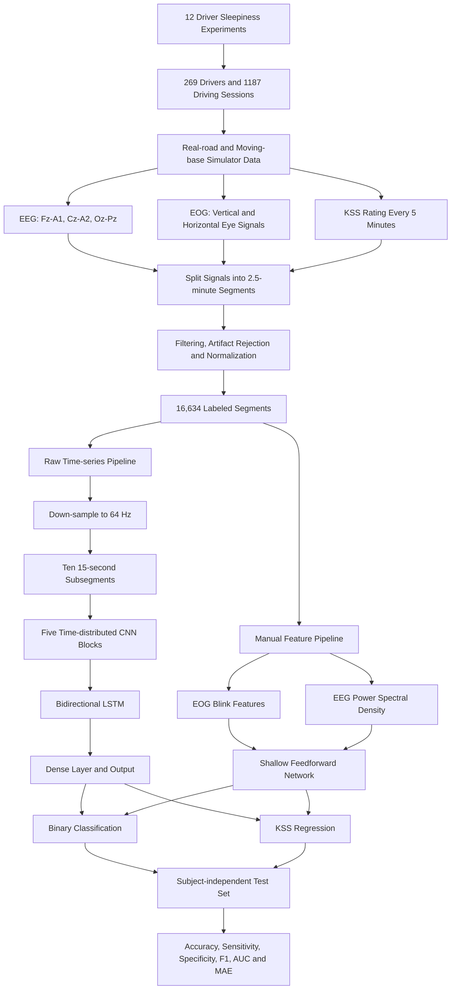

# information

|   |   |
|---|---|
|Title|Driver sleepiness detection with deep neural networks using electrophysiological data|
|Author|Martin Hultman, Ida Johansson, Frida Lindqvist, Christer Ahlström|
|Journal|Physiological Measurement|
|Year|2021|
|DOI|[10.1088/1361-6579/abe91e](https://doi.org/10.1088/1361-6579/abe91e)|

# abstract

> **Objective.** The objective of this paper is to present a driver sleepiness detection model based on electrophysiological data and a neural network consisting of convolutional neural networks and a long short-term memory architecture.

**目标.** 本文旨在提出一种基于电生理数据的驾驶员困倦检测模型,其神经网络由卷积神经网络和长短期记忆网络组成.

> **Approach.** The model was developed and evaluated on data from 12 different experiments with 269 drivers and 1187 driving sessions during daytime (low sleepiness condition) and night-time (high sleepiness condition), collected during naturalistic driving conditions on real roads in Sweden or in an advanced moving-base driving simulator. Electrooculographic and electroencephalographic time series data, split up in 16 634 2.5 min data segments was used as input to the deep neural network. This probably constitutes the largest labeled driver sleepiness dataset in the world. The model outputs a binary decision as alert (defined as ≤6 on the Karolinska Sleepiness Scale, KSS) or sleepy (KSS ≥ 8) or a regression output corresponding to KSS ∈ [1–5, 6, 7, 8, 9].

**方法.** 模型使用来自12项不同实验的数据进行开发和评估,共包括269名驾驶员和1187次驾驶过程. 实验分别在白天的低困倦条件和夜间的高困倦条件下进行,数据采集环境包括瑞典真实道路和高级运动基座驾驶模拟器. 研究将眼电和脑电时间序列划分为16634个长度为2.5 min的数据片段,并将其作为深度神经网络的输入. 这可能是当时世界上规模最大的带标签驾驶员困倦数据集. 模型既可以输出二分类结果,即清醒(Karolinska Sleepiness Scale,KSS≤6)或困倦(KSS≥8),也可以输出对应于KSS∈[1-5,6,7,8,9]的回归结果.

> **Main results.** The subject-independent mean absolute error (MAE) was 0.78. Binary classification accuracy for the regression model was 82.6% as compared to 82.0% for a model that was trained specifically for the binary classification task. Data from the eyes were more informative than data from the brain. A combined input improved performance for some models, but the gain was very limited.

**主要结果.** 在跨被试评估中,模型的平均绝对误差(MAE)为0.78. 将回归模型的输出转换为二分类结果后,其准确率为82.6%,高于专门针对二分类任务训练的模型所取得的82.0%. 眼部数据比脑部数据包含更多与困倦相关的信息. 在部分模型中同时使用眼电和脑电能够提高性能,但提升幅度非常有限.

> **Significance.** Improved classification results were achieved with the regression model compared to the classification model. This suggests that the implicit order of the KSS ratings, i.e. the progression from alert to sleepy, provides important information for robust modelling of driver sleepiness, and that class labels should not simply be aggregated into an alert and a sleepy class. Furthermore, the model consistently showed better results than a model trained on manually extracted features based on expert knowledge, indicating that the model can detect sleepiness that is not covered by traditional algorithms.

**意义.** 与直接分类模型相比,回归模型取得了更好的分类结果. 这说明KSS评分从清醒到困倦的内在顺序能够为稳健的驾驶员困倦建模提供重要信息,不应简单地将所有评分合并为清醒和困倦两个类别. 此外,深度模型的表现始终优于使用专家知识手工提取特征训练的模型,说明该模型能够识别传统算法未能覆盖的困倦信息.

# workflow

The study combines data from five real-road experiments and seven simulator experiments. KSS was reported every five minutes, while EEG and EOG recordings were divided into 2.5-minute segments, meaning that two consecutive segments generally shared the same KSS label. The authors compared an end-to-end CNN-LSTM model using raw time-series data with a conventional shallow neural network using manually designed EEG and EOG features.

该研究合并了5项真实道路实验和7项驾驶模拟器实验的数据. 驾驶员每5 min报告一次KSS,而EEG和EOG被划分为长度为2.5 min的片段,因此通常有两个连续片段对应同一个KSS标签. 作者比较了两种技术路线:一种是直接输入原始时间序列的端到端CNN-LSTM模型,另一种是输入人工设计EEG和EOG特征的浅层神经网络.

# core method

## Dataset and Subject-independent Evaluation

A major strength of the work is the scale and ecological validity of its dataset. The database contains 269 drivers, 1187 driving sessions and 16,634 labeled signal segments. Five experiments were conducted on real roads, while seven used an advanced moving-base simulator. Most participants completed both an alert daytime condition and a sleep-deprived night-time condition, allowing the dataset to contain a broad progression from alertness to severe sleepiness rather than artificially simulated sleepy behavior.

这项工作的主要优势之一是数据规模较大,并且具有较高的生态效度. 数据库包含269名驾驶员,1187次驾驶过程和16634个带标签的信号片段. 其中5项实验在真实道路上完成,另外7项实验使用高级运动基座驾驶模拟器. 大多数参与者既完成了白天清醒条件,也完成了睡眠不足后的夜间驾驶条件,因此数据能够反映从清醒到严重困倦的自然变化过程,而不是让参与者通过打哈欠或闭眼等方式主动表演困倦.

The data split was subject-independent. The test set contained the first 20% of drivers from each of the 12 experiments, while the remaining participants were randomly assigned to the training and validation sets. The final proportions were 56% for training, 24% for validation and 20% for testing. Therefore, no driver in the test set appeared during model training. This is stricter than randomly mixing all signal segments, although it is a single unseen-subject holdout split rather than leave-one-subject-out cross-validation.

该研究采用跨被试的数据划分方式. 每项实验中前20%的驾驶员被放入测试集,其余驾驶员的数据再被随机分配到训练集和验证集,最终比例为训练集56%,验证集24%,测试集20%. 因此测试集驾驶员从未出现在模型训练过程中. 这种划分比将所有人的片段随机混合后再划分更加严格,但它仍然属于一次固定的未知被试留出测试,而不是leave-one-subject-out交叉验证.

## Labels: Binary Classification and Ordered Regression

The authors formulated sleepiness detection in two ways. For binary classification, KSS≤6 was defined as alert and KSS≥8 as sleepy, while KSS=7 samples were removed to create a clearer boundary between the two classes. For regression, KSS values 1-5 were pooled into one non-sleepy level, followed by the ordered levels 6, 7, 8 and 9. The network produced a continuous scalar output, preserving the progression from alertness to severe sleepiness.

作者以两种方式定义困倦检测任务. 在二分类任务中,KSS≤6被定义为清醒,KSS≥8被定义为困倦,而处于过渡状态的KSS=7样本被删除,从而使两个类别之间的边界更加清晰. 在回归任务中,KSS 1-5被合并为一个非困倦等级,之后依次保留6,7,8和9这几个有序等级. 网络输出一个连续数值,从而保留从清醒到严重困倦的变化顺序.

This design is one of the most important ideas in the paper. A binary classifier treats alert and sleepy as unrelated category names, whereas a regression model is penalized according to the distance between the predicted and true KSS values. Predicting KSS 8 as KSS 7 is therefore less serious than predicting it as the alert level. The regression error was evaluated using:

\[
\mathrm{MAE}=\frac{1}{n}\sum_{i=1}^{n}\left|y_i-\hat{y}_i\right|
\]

这种标签设计是本文最重要的思想之一. 普通二分类模型只将清醒和困倦视为两个互不相关的类别名称,而回归模型会根据预测KSS与真实KSS之间的距离受到不同程度的惩罚. 因此,将KSS 8预测为KSS 7所产生的误差,应当小于将其预测为清醒状态所产生的误差. 这种设计使模型能够学习KSS标签的有序结构,而不仅是学习一个二元决策边界.

## Signal Preprocessing

The deep model used three bipolar EEG derivations, Fz-A1, Cz-A2 and Oz-Pz, together with vertical EOG. EEG was band-pass filtered between 0.3 and 40 Hz. Segments with amplitudes above 200 μV were regarded as artifacts, while segments with maximum amplitudes below 5 μV were treated as possible detached-electrode recordings. Each EEG segment was normalized using its 1st and 99th percentiles, which robustly compressed most values into a range close to [-1,1].

深度模型使用3个双极EEG导联Fz-A1,Cz-A2和Oz-Pz,并结合垂直EOG信号. EEG经过0.3-40 Hz带通滤波. 幅值超过200 μV的片段被视为伪迹,最大幅值低于5 μV的片段则被认为可能存在电极脱落. 每个EEG片段使用自身的第1百分位数和第99百分位数进行归一化,从而将大多数数值稳健地压缩到接近[-1,1]的范围.

EOG was low-pass filtered at 11.52 Hz. Baseline drift and signal saturation caused by motion artifacts were reduced by subtracting a piecewise linear function. Each EOG segment was then mean-centered and divided by its median blink amplitude. The artifact rejection strategy was intentionally simple and mainly removed extreme outliers rather than performing comprehensive physiological artifact correction.

EOG使用截止频率为11.52 Hz的低通滤波器进行处理. 对于运动伪迹造成的基线漂移和信号饱和,作者通过减去分段线性函数进行校正. 随后,每个EOG片段先减去均值,再除以该片段的中位眨眼幅值. 需要注意的是,论文中的伪迹处理方法较为基础,其主要目标是删除极端异常片段,而不是进行完整的生理伪迹校正.

## CNN-LSTM Architecture

Before entering the deep network, EEG and EOG were down-sampled to 64 Hz. Each 150-second segment was divided into ten consecutive 15-second subsegments, with 960 samples in each subsegment. The resulting input shape was `(N,10,960,C)`, where `C=1` for EOG, `C=3` for EEG and `C=4` when EEG and EOG were combined.

在进入深度网络之前,EEG和EOG被降采样至64 Hz. 每个150 s片段被进一步划分为10个连续的15 s子片段,每个子片段包含960个采样点. 最终输入张量的形状为`(N,10,960,C)`,其中仅使用EOG时`C=1`,仅使用EEG时`C=3`,同时使用EEG和EOG时`C=4`.

Every subsegment was processed by the same CNN through Keras's `TimeDistributed` mechanism. The CNN contained five convolutional blocks. Each block consisted of a one-dimensional convolution, Leaky ReLU activation, batch normalization, max pooling and 20% spatial dropout. The convolutional filters learned local waveform patterns such as blinks, saccades and rapid signal changes without requiring the researchers to define these patterns manually.

每个子片段通过Keras的`TimeDistributed`机制进入同一个CNN,因此10个子片段共享完全相同的卷积权重. CNN包含5个卷积模块,每个模块依次包括一维卷积,Leaky ReLU激活,批归一化,最大池化和20%的空间dropout. 这些卷积层可以直接从波形中学习眨眼,扫视和快速幅值变化等局部模式,不需要研究人员预先定义这些模式.

The CNN representation from each subsegment was passed to a bidirectional LSTM. The LSTM modeled how the extracted patterns changed across the full 2.5-minute interval, allowing the network to distinguish an isolated blink from a sustained pattern of slow or repeated blinking. The LSTM outputs were concatenated and passed through a 128-unit fully connected layer with tanh activation and 20% dropout. The final layer used either one linear unit for regression or two softmax units for binary classification.

每个子片段的CNN表示随后被输入双向LSTM. LSTM用于建模这些特征在完整2.5 min时间范围内的变化,使模型能够区分偶然出现的一次眨眼和持续出现的缓慢眨眼或连续眨眼模式. LSTM输出被拼接后输入一个包含128个单元的全连接层,该层使用tanh激活和20%的dropout. 最终输出层在回归任务中使用一个线性节点,在二分类任务中使用两个softmax节点.

The division of labor between the two components is clear: the CNN acts as an automatic short-term feature extractor, while the LSTM integrates these features over a longer temporal scale. This architecture was adapted from deep-learning systems for automatic sleep-stage classification, where local physiological waveforms and longer temporal transitions are both important.

CNN和LSTM之间具有明确的功能分工:CNN负责自动提取短时间尺度上的局部波形特征,LSTM则在更长时间范围内整合这些特征. 这种结构借鉴了自动睡眠分期模型,因为无论是睡眠分期还是驾驶困倦检测,都需要同时考虑局部生理波形和较长时间尺度上的状态变化.

## Manual-feature Baseline

To determine whether the deep model learned more information than traditional expert-designed indicators, the authors constructed a shallow neural-network baseline. For EOG, nine blink-related measurements were extracted, including blink duration, eyelid closing and opening speeds, peak speeds and reopening delay. Five percentiles were calculated for each measurement, producing 45 EOG features per segment.

为了判断深度模型是否学习到了传统专家特征之外的信息,作者构建了一个浅层神经网络基线. 对于EOG,研究人员人工提取了9种眨眼相关指标,包括眨眼持续时间,眼睑闭合和睁开速度,峰值速度以及重新睁眼延迟等. 每种指标分别计算5个百分位数,因此每个片段共得到45个EOG特征.

For EEG, Welch's method was applied to the Oz-Pz channel to estimate power spectral density in 31 frequency bins between 0 and 30 Hz. The manual EOG and EEG features were separately or jointly passed to a feedforward network with one 64-unit hidden layer. This comparison controlled for both the input modality and prediction task, making it possible to test whether end-to-end feature learning added value.

对于EEG,作者使用Welch方法估计Oz-Pz导联在0-30 Hz范围内31个频率点的功率谱密度. 人工EOG特征和EEG特征可以单独输入,也可以拼接后输入一个包含64个隐藏节点的前馈神经网络. 这种设置同时控制了输入模态和预测任务,因此能够较公平地检验端到端特征学习是否真正带来了额外价值.

## Training Strategy

CNN-LSTM models were optimized with Adam using an initial learning rate of 0.0004, a batch size of 256 and 300 training epochs. Binary classification used binary cross-entropy, while regression used MAE. Class weights were applied to reduce the influence of class imbalance, and both L1 and L2 regularization were used in the deep model.

CNN-LSTM模型使用Adam优化器训练,初始学习率为0.0004,batch size为256,训练轮数为300. 二分类任务使用binary cross-entropy损失,回归任务使用MAE损失. 为减轻类别不平衡的影响,训练过程中使用了类别权重,同时深度模型还使用了L1和L2正则化.

For every combination of input modality and prediction task, ten networks were trained from different random initializations. The model with the best validation MAE for regression, or the best validation AUC for classification, was selected and evaluated once on the held-out test set. This reduces sensitivity to an unlucky initialization while keeping the final test evaluation independent.

对于每一种输入模态和预测任务组合,作者都从不同随机初始化出发训练10个网络. 回归任务根据验证集MAE选择最佳模型,分类任务则根据验证集AUC选择最佳模型,最后仅在独立测试集上进行评估. 这种方法能够降低随机初始化造成的偶然波动,同时避免直接根据测试集结果选择模型.

# result

## Regression Performance

The lowest subject-independent regression error was achieved by the CNN-LSTM using combined EOG and EEG input, with an MAE of 0.78. EOG-only and EEG-only models obtained MAEs of approximately 0.80 and 0.81, respectively. In comparison, the best manually engineered baseline had an MAE of 0.97. On average, the deep model's estimated sleepiness level was therefore less than one KSS unit away from the reported score.

在跨被试回归任务中,同时输入EOG和EEG的CNN-LSTM取得了最低误差,MAE为0.78. 仅使用EOG和仅使用EEG的模型MAE分别约为0.80和0.81. 相比之下,基于人工特征的最佳模型MAE为0.97. 因此从平均意义上看,深度模型预测的困倦水平与驾驶员报告的KSS相差不到1个等级.

However, the rounded five-level classification accuracy of the regression models was only about 45%. Most errors occurred between neighboring KSS levels, which explains how the model could obtain a relatively low MAE while having modest exact-level accuracy. More importantly, approximately 17% of segments labeled as severely sleepy at KSS≥8 were estimated as alert at KSS≤6, showing that the system still made some safety-critical errors.

但是,将连续回归结果取整到5个等级后,模型的准确率只有约45%. 大多数错误发生在相邻KSS等级之间,这解释了为什么模型能够取得较低的MAE,但精确等级准确率仍然不高. 更值得注意的是,约17%的KSS≥8严重困倦片段被模型预测为KSS≤6的清醒状态,说明系统仍然会产生一部分具有安全风险的漏检.

## Binary Classification Performance

For models trained directly on the binary task, the best overall model used combined EOG and EEG. It achieved 82.0% accuracy, 82.1% sensitivity, 82.0% specificity, an F1 score of 70.0% and an AUC of 0.90. The EEG-only binary model had the highest sensitivity at 87.1%, but its lower specificity reduced the overall accuracy to 76.9%.

对于直接训练的二分类模型,同时使用EOG和EEG的模型总体表现最佳. 其准确率为82.0%,灵敏度为82.1%,特异度为82.0%,F1为70.0%,AUC为0.90. 仅使用EEG的二分类模型取得了最高灵敏度87.1%,但由于特异度较低,总体准确率只有76.9%.

A particularly interesting result appeared when the regression outputs were converted into alert and sleepy decisions. The EOG-only regression model achieved 82.6% accuracy, 84.1% sensitivity, 82.1% specificity, an F1 score of 71.2% and an AUC of 0.90. It outperformed the model specifically trained for binary classification on every reported metric.

一个特别值得关注的结果出现在将回归输出转换为清醒和困倦二分类之后. 仅使用EOG的回归模型取得了82.6%的准确率,84.1%的灵敏度,82.1%的特异度,71.2%的F1和0.90的AUC. 在论文报告的所有指标上,它都超过了专门针对二分类任务训练的最佳模型.

This finding supports the authors' central argument: the ordered information contained in KSS labels improves representation learning. Although the final application may only require an alert-or-sleepy warning, training the model on the full progression of sleepiness can produce a more robust decision boundary than directly collapsing the labels into two classes.

这一结果支持了作者最核心的观点:KSS标签中的有序信息能够改善模型学习. 即使最终应用只需要输出清醒或困倦警报,在训练阶段让模型学习完整的困倦变化过程,也可能比直接将所有标签压缩为两个类别获得更加稳健的决策边界.

## EOG versus EEG

Across most experiments, EOG contained more useful information than EEG. For direct binary classification, EOG alone achieved 81.4% accuracy, compared with 76.9% for EEG alone. For regression-derived binary classification, EOG achieved 82.6%, whereas EEG achieved 74.0%. Combining the modalities occasionally improved performance, but the gain was small and inconsistent.

在大多数实验中,EOG所包含的困倦信息多于EEG. 在直接二分类任务中,仅使用EOG的准确率为81.4%,而仅使用EEG时为76.9%. 在由回归结果转换得到的二分类任务中,EOG模型准确率为82.6%,EEG模型则为74.0%. 同时使用两种信号有时能够提高性能,但提升幅度较小且不稳定.

The learned intermediate representations also provide a plausible explanation. Early CNN layers appeared to respond to recognizable ocular events such as blinks and saccades, while later layers combined them into more complex patterns such as clusters of rapid blinking. These temporal eye-behavior patterns may be more directly and consistently related to subjective sleepiness than the relatively noisy three-channel EEG recorded during driving.

模型中间层的表示为这一结果提供了合理解释. 较浅的CNN层似乎能够识别眨眼和扫视等眼部事件,而更深层则能够将其组合为连续快速眨眼等复杂模式. 与驾驶过程中采集的3通道且噪声相对较大的EEG相比,这些眼部行为的时间模式可能与主观困倦程度存在更加直接和稳定的关系.

## Deep Learning versus Manual Features

The CNN-LSTM consistently outperformed the shallow networks based on expert-designed blink and spectral features. In the binary task, the strongest deep model reached 82.0% accuracy, while the best manual-feature model reached 75.2%. In regression, the deep model reduced MAE from 0.97 to 0.78. The improvement suggests that the network learned waveform characteristics not fully represented by conventional blink statistics or EEG power spectra.

CNN-LSTM的表现稳定优于使用专家设计眨眼特征和频谱特征的浅层网络. 在二分类任务中,最佳深度模型准确率为82.0%,而最佳人工特征模型为75.2%. 在回归任务中,深度模型将MAE从0.97降低至0.78. 这一提升说明网络学习到了一些无法被传统眨眼统计量或EEG功率谱完整表达的波形特征.

The learning curve had not clearly saturated when all available training segments were used. AUC continued to increase as the number of training examples grew, suggesting that the architecture was still data-limited. The authors therefore proposed that larger driver datasets or pretraining on clinical sleep databases could further improve performance, particularly for the EEG branch.

当全部训练片段被使用时,模型的学习曲线仍未明显达到平台期. 随着训练样本数量增加,AUC仍在继续上升,说明该架构的性能仍然受到数据规模限制. 因此作者提出,未来可以使用更大规模的驾驶员数据集,或先在临床睡眠数据库上预训练模型,尤其是预训练EEG相关网络部分.

## Interpretation and Limitations

This paper is valuable because it combines a comparatively large dataset, realistic driving conditions, subject-independent evaluation and a direct comparison between raw-signal deep learning and expert-designed features. Its most transferable methodological conclusion is not simply that CNN-LSTM performs well, but that preserving the ordinal structure of sleepiness labels can improve a final binary warning system.

这篇论文的价值在于,它同时具备相对较大的数据规模,较真实的驾驶环境,跨被试评估以及深度学习与人工特征之间的直接比较. 论文最值得迁移的方法学结论并不只是CNN-LSTM表现较好,而是保留困倦标签的有序结构,可能反而有助于构建最终的二分类警报系统.

Several limitations should still be considered. KSS is a subjective label and may differ between participants. Repeated KSS reporting may itself temporarily increase alertness. The study merged real-road and simulator data, even though sleepiness develops differently in the two environments. Artifact rejection was relatively simple, and the physiological electrodes used in the experiments are too obtrusive for ordinary consumer vehicles.

这项研究仍然存在一些需要注意的局限. KSS属于主观标签,不同参与者可能采用不同的评分标准. 反复报告KSS本身也可能短暂提高驾驶员的清醒程度. 研究将真实道路和模拟器数据合并使用,但困倦在两种环境中的发展速度并不完全相同. 此外,论文采用的伪迹剔除方法较为简单,实验中的生理电极也过于侵入,难以直接应用于普通车辆.

The test set was subject-independent, but evaluation was based on one fixed holdout rather than repeated cross-validation or an entirely external dataset. Consequently, the reported accuracy demonstrates generalization to the selected unseen drivers, but it does not completely establish robustness across different countries, sensor systems, electrode placements or driving protocols.

测试集虽然实现了跨被试划分,但评估仍然基于一次固定留出,而不是重复交叉验证或完全独立的外部数据集. 因此,论文结果能够证明模型可以泛化到当前数据集中选定的未知驾驶员,但尚不能完全证明模型可以稳健迁移到不同国家,不同采集设备,不同电极位置或不同驾驶实验协议中.

Overall, the paper shows that a CNN-LSTM can learn useful sleepiness representations directly from raw electrophysiological signals and outperform conventional feature engineering. More importantly, it demonstrates that sleepiness should be modeled as an ordered and gradually changing state. Even when the final goal is binary detection, regression or other ordinal-learning methods may preserve information that would otherwise be lost during label simplification.

总体而言,本文证明了CNN-LSTM能够直接从原始电生理信号中学习有效的困倦表示,并优于传统人工特征工程. 更重要的是,研究说明困倦应当被建模为一个具有顺序且逐渐变化的状态. 即使最终目标是二分类检测,回归或其他序数学习方法也可能保留标签简化过程中原本会被丢失的信息.
