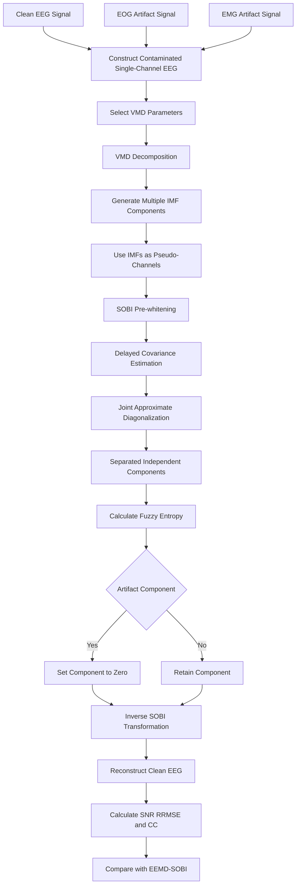

# information

|   |   |
|---|---|
|Title|Remove Artifacts from a Single-Channel EEG Based on VMD and SOBI|
|Author|Changrui Liu; Chaozhu Zhang|
|Journal|Sensors|
|Year|2022|
|DOI|[10.3390/s22176698](https://doi.org/10.3390/s22176698)|

# abstract

> With the development of portable EEG acquisition systems, the collected EEG has gradually changed from being multi-channel to few-channel or single-channel, thus the removal of single-channel EEG signal artifacts is extremely significant. For the artifact removal of single-channel EEG signals, the current mainstream method is generally a combination of the decomposition method and the blind source separation (BSS) method. Between them, a combination of empirical mode decomposition (EMD) and its derivative methods and ICA has been used in single-channel EEG artifact removal. However, EMD is prone to modal mixing and it has no relevant theoretical basis, thus it is not as good as variational modal decomposition (VMD) in terms of the decomposition effect. In the ICA algorithm, the implementation method based on high-order statistics is widely used, but it is not as effective as the implementation method based on second order statistics in processing EMG artifacts. Therefore, aiming at the main artifacts in single-channel EEG signals, including EOG and EMG artifacts, this paper proposed a method of artifact removal combining variational mode decomposition (VMD) and second order blind identification (SOBI). Semi-simulation experiments show that, compared with the existing EEMD-SOBI method, this method has a better removal effect on EOG and EMG artifacts, and can preserve useful information to the greatest extent.

随着便携式EEG采集系统的发展,所采集的EEG逐渐从多通道转向少通道或单通道,因此单通道EEG伪迹去除具有重要意义. 对于单通道EEG伪迹去除,当前主流方法通常将信号分解方法与盲源分离方法结合. 其中,经验模态分解及其衍生方法与ICA的组合已经被用于单通道EEG伪迹去除. 然而,EMD容易产生模态混叠,且缺乏相关理论基础,因此在分解效果方面不如变分模态分解. 在ICA算法中,基于高阶统计量的实现方式应用广泛,但在处理EMG伪迹时,其效果不如基于二阶统计量的实现方式. 因此,针对单通道EEG中的主要伪迹,包括EOG和EMG伪迹,本文提出了一种结合VMD与二阶盲辨识的伪迹去除方法. 半仿真实验表明,与现有的EEMD-SOBI方法相比,该方法对EOG和EMG伪迹具有更好的去除效果,并能在最大程度上保留有用信息.

# workflow

The method first constructs contaminated single-channel EEG by combining clean EEG with EOG or EMG artifacts. VMD decomposes the signal into several intrinsic mode functions, which are treated as pseudo-channels for SOBI. After source separation, fuzzy entropy is used to identify artifact components, and the remaining components are reconstructed into cleaned EEG.

该方法首先将纯净EEG与EOG或EMG伪迹叠加,构造含伪迹的单通道EEG. VMD将信号分解为若干本征模态函数,这些模态随后被作为SOBI的伪通道输入. 在完成源分离后,算法利用模糊熵识别伪迹成分,删除伪迹后再使用剩余成分重构纯净EEG.

# core method

## 1. Why single-channel artifact removal is difficult

Blind source separation methods normally require multiple observed channels. A conventional BSS model assumes that several sensors record different mixtures of several unknown source signals. When only one EEG channel is available, the number of observations is insufficient to directly estimate the underlying EEG, EOG, and EMG sources.

盲源分离方法通常需要多个观测通道. 传统BSS模型假设多个传感器记录了多个未知源信号的不同混合结果. 当系统只有一个EEG通道时,观测数量不足,无法直接估计潜在的EEG,EOG和EMG源信号.

The contaminated signal can be conceptually expressed as:

$$
x(t)=s_{\mathrm{EEG}}(t)+a_{\mathrm{EOG}}(t)+a_{\mathrm{EMG}}(t)
$$

Here, $s_{\mathrm{EEG}}(t)$ represents the desired neural signal, while $a_{\mathrm{EOG}}(t)$ and $a_{\mathrm{EMG}}(t)$ represent ocular and muscular artifacts. The key problem is that several sources are mixed into only one observed waveform.

其中,$s_{\mathrm{EEG}}(t)$表示希望保留的脑电信号,$a_{\mathrm{EOG}}(t)$和$a_{\mathrm{EMG}}(t)$分别表示眼电伪迹和肌电伪迹. 关键问题在于,多个潜在源被混合在一条观测波形中,因此常规多通道盲源分离无法直接使用.

The paper solves this underdetermined problem by introducing a signal decomposition stage. Instead of directly applying BSS to the original signal, the authors first decompose the single-channel waveform into several components and regard these components as multiple pseudo-observations.

本文通过增加信号分解步骤解决这一欠定问题. 作者并不直接对原始单通道信号执行BSS,而是先将单通道波形分解为若干成分,再将这些成分视为多路伪观测信号.

## 2. Variational mode decomposition

Variational mode decomposition is an optimization-based signal decomposition method. It represents the input signal as the sum of $K$ band-limited amplitude-modulated and frequency-modulated modes. Each mode has its own center frequency and bandwidth.

变分模态分解是一种基于优化问题的信号分解方法. 它将输入信号表示为$K$个带宽受限的调幅调频模态之和. 每个模态具有相应的中心频率和带宽.

The main constrained variational problem can be written as:

$$
\begin{aligned}
\min_{\mathbf{U},\boldsymbol{\Omega}}\quad
&\sum_{k=1}^{K}
\left\lVert
\partial_t
\left[
\left(
\delta(t)+\frac{j}{\pi t}
\right)
*u_k(t)
\right]
e^{-j\omega_k t}
\right\rVert_2^2
\\
\text{subject to}\quad
&\sum_{k=1}^{K}u_k(t)=f(t)
\end{aligned}
$$

In this expression, $f(t)$ is the original signal, $u_k(t)$ is the $k$-th mode, and $\omega_k$ is the center frequency of that mode. The objective is to minimize the total bandwidth of all modes while requiring their sum to reconstruct the original signal.

在该公式中,$f(t)$表示原始信号,$u_k(t)$表示第$k$个模态,$\omega_k$表示该模态的中心频率. 优化目标是最小化全部模态的总带宽,同时要求这些模态之和能够重构原始信号.

Compared with EMD, VMD performs decomposition within a unified variational framework rather than recursively extracting modes according to local extrema. The authors argue that this design reduces mode mixing, suppresses endpoint effects, and improves noise robustness.

与EMD相比,VMD在统一的变分框架中同时估计多个模态,而不是根据局部极值点递归提取模态. 作者认为,这种设计能够减少模态混叠,减弱端点效应,并提高算法的抗噪性.

VMD does not directly remove the artifacts. Its main role is to transform one observed waveform into several IMF components. These components form a pseudo-multichannel dataset that can be processed by SOBI.

VMD并不直接负责删除伪迹. 它的主要作用是将一条观测波形转换为若干IMF成分. 这些成分共同形成伪多通道数据,从而为SOBI提供可处理的多路输入.

## 3. Second order blind identification

After VMD decomposition, each IMF is still not guaranteed to correspond exactly to one physiological source. An IMF may contain a mixture of EEG and artifact activity. The paper therefore applies SOBI to further separate the components.

完成VMD分解后,每个IMF仍然不一定与某一个生理源完全对应. 一个IMF中可能同时包含EEG与伪迹活动. 因此,论文进一步使用SOBI对这些成分进行分离.

The basic blind source separation model is:

$$
\mathbf{X}(t)=\mathbf{A}\mathbf{S}(t)+\mathbf{N}(t)
$$

Here, $\mathbf{X}(t)$ contains the observed pseudo-channels, $\mathbf{S}(t)$ contains the unknown source signals, $\mathbf{A}$ is the mixing matrix, and $\mathbf{N}(t)$ represents noise.

其中,$\mathbf{X}(t)$包含由VMD模态组成的伪观测通道,$\mathbf{S}(t)$表示未知源信号,$\mathbf{A}$表示混合矩阵,$\mathbf{N}(t)$表示噪声.

SOBI first whitens the observed signals to remove instantaneous correlations between channels. It then calculates covariance matrices at multiple time delays and searches for an orthogonal transformation that jointly approximately diagonalizes these matrices.

SOBI首先对白化后的观测信号进行处理,去除不同通道之间的瞬时相关性. 随后,算法计算多个时间延迟下的协方差矩阵,并寻找一个正交变换,使这些协方差矩阵能够被近似同时对角化.

The separated components can be represented as:

$$
\mathbf{Y}(t)=\mathbf{V}^{\mathrm{T}}\mathbf{Q}\mathbf{X}(t)
$$

Here, $\mathbf{Q}$ is the whitening matrix and $\mathbf{V}$ is the joint diagonalization matrix. The output components are separated according to differences in their temporal autocorrelation structures.

其中,$\mathbf{Q}$表示白化矩阵,$\mathbf{V}$表示联合对角化矩阵. 输出成分根据各自时间自相关结构的差异被分离.

Many ICA algorithms rely on higher-order statistics and non-Gaussianity. SOBI instead relies on second-order temporal statistics. The authors state that SOBI is more suitable for EMG artifact processing because its performance does not require the source signals to follow a particular non-Gaussian distribution.

许多ICA算法依赖高阶统计量以及信号的非高斯性. SOBI主要利用二阶时间统计特征. 作者认为,SOBI不要求源信号满足特定的非高斯分布,因此在处理EMG伪迹时比部分基于高阶统计量的ICA实现更加合适.

## 4. Artifact recognition with fuzzy entropy

VMD-SOBI produces a set of separated components, but the algorithm still needs to determine which components represent EEG and which components represent artifacts. The paper uses fuzzy entropy as the recognition index.

VMD-SOBI能够产生一组分离成分,但算法仍然需要判断哪些成分属于EEG,哪些成分属于伪迹. 本文使用模糊熵作为成分识别指标.

Fuzzy entropy measures the complexity and irregularity of a time series. A smoother and more regular waveform generally has lower fuzzy entropy, while an irregular high-frequency waveform generally has higher fuzzy entropy.

模糊熵用于衡量时间序列的复杂性和不规则程度. 更平滑且更规则的波形通常具有较低的模糊熵,而不规则的高频波形通常具有较高的模糊熵.

The fuzzy entropy values reported for IC1, IC2, and IC3 were:

|Component|IC1|IC2|IC3|
|---|---:|---:|---:|
|Fuzzy entropy|$1.7\times10^{-3}$|$2\times10^{-4}$|$8.84\times10^{-2}$|

IC2 showed a slowly varying and smooth waveform and was identified as an EOG artifact. IC3 showed irregular high-frequency activity and had the highest fuzzy entropy, so it was identified as an EMG artifact. IC1 was retained as the EEG-related component.

IC2呈现缓慢变化且较平滑的波形,因此被识别为EOG伪迹. IC3包含不规则的高频活动,并具有最高的模糊熵,因此被识别为EMG伪迹. IC1则被保留为与EEG相关的成分.

After recognition, the artifact components are set to zero. The remaining components are transformed back through the inverse SOBI process and combined to reconstruct the cleaned single-channel EEG.

完成识别后,算法将伪迹成分设置为零. 剩余成分通过SOBI逆变换映射回原信号空间,随后进行组合,最终重构得到去除伪迹后的单通道EEG.

## 5. VMD parameter selection

The performance of VMD depends strongly on its parameters. The final parameter settings used in the main experiment were:

|Parameter|Value|
|---|---:|
|Number of modes $K$|3|
|Noise tolerance $\gamma$|0|
|Initial center frequencies|5 Hz, 30 Hz, 150 Hz|
|Quadratic penalty factor $\alpha$|1500|
|Convergence tolerance $\varepsilon$|$10^{-5}$|

The initial center frequencies were selected according to the expected frequency ranges of the source signals. The paper treated EOG as mainly distributed at $0$-$5$ Hz, EEG at $10$-$50$ Hz, and EMG at $80$-$250$ Hz.

初始中心频率根据不同源信号的预期频率范围设置. 论文将EOG主要频段设为$0$-$5$ Hz,将EEG主要频段设为$10$-$50$ Hz,将EMG主要频段设为$80$-$250$ Hz.

The authors found that fixed initial center frequencies were more stable than initializing all frequencies at zero or using random values. Appropriate initialization reduced the search range and made the final decomposition less sensitive to the penalty factor and input SNR.

作者发现,固定初始中心频率比将全部频率初始化为零或采用随机值更加稳定. 合理的初始化能够缩小搜索范围,并使最终分解结果对惩罚因子和输入SNR的变化更加稳健.

The number of modes $K$ was the most important parameter. When $K$ was too small, several frequency components remained mixed in the same mode. When $K$ was too large, one source frequency band was divided into several overlapping modes.

模态数量$K$是最重要的参数. 当$K$过小时,多个频率成分会继续混合在同一个模态中. 当$K$过大时,一个源信号频段可能被拆分为多个相互重叠的模态.

The paper proposes a rule that compares the center frequencies obtained under $K$ and $K+1$ decompositions:

$$
\varepsilon_{K,a}
=
\frac{\omega_{K,a}}
{\omega_{K+1,a}}
$$

Here, $\omega_{K,a}$ is the center frequency of the $a$-th mode when the number of modes is $K$. If $\varepsilon_{K,a}$ is greater than or equal to $1.2$, or less than or equal to $1$, the corresponding center frequency is considered invalid. The first $K$ value producing an invalid center frequency is selected as the decomposition number.

其中,$\omega_{K,a}$表示模态数量为$K$时第$a$阶模态的中心频率. 当$\varepsilon_{K,a}$大于等于$1.2$,或者小于等于$1$时,对应的中心频率被判断为无效. 第一次出现无效中心频率时对应的$K$值被选为最终分解数量.

For the semi-simulated signal used in this paper, the procedure selected $K=3$. This result is consistent with the mixture containing three main signal types: EEG, EOG, and EMG.

对于本文使用的半仿真信号,该方法最终选择$K=3$. 这一结果与混合信号中包含EEG,EOG和EMG这3类主要信号成分相一致.

## 6. Main contributions

The first contribution is the construction of a VMD-SOBI framework for removing both EOG and EMG artifacts from single-channel EEG. VMD creates pseudo-channels, while SOBI separates sources according to temporal covariance information.

第一项贡献是构建了用于同时去除单通道EEG中EOG和EMG伪迹的VMD-SOBI框架. VMD负责生成伪通道,SOBI则根据时间协方差信息进一步分离不同源信号.

The second contribution is replacing EEMD with VMD. EEMD reduces mode mixing by repeatedly adding noise and averaging the decomposition results, but residual noise and stochastic variation may remain. VMD formulates decomposition as a deterministic optimization problem and allows explicit control over mode number, center frequency, and bandwidth.

第二项贡献是使用VMD替代EEMD. EEMD通过反复加入噪声并对多次分解结果取平均来减少模态混叠,但可能留下残余噪声和随机波动. VMD将分解表示为确定性的优化问题,并允许显式控制模态数量,中心频率和带宽.

The third contribution is the parameter analysis, especially the automatic selection rule for $K$. Instead of only reporting one manually selected configuration, the paper investigates under-decomposition, over-decomposition, noise tolerance, initial center frequency, and the quadratic penalty factor.

第三项贡献是对VMD参数进行了较系统的分析,尤其是提出了自动选择$K$值的规则. 论文不仅给出一组人工设置的参数,还研究了欠分解,过分解,噪声容限,初始中心频率以及二次惩罚因子的影响.

# result

## 1. Experimental data

The evaluation was based on semi-simulated signals. Clean EEG was obtained from Graz Dataset B of BCI Competition IV. The dataset recorded EEG from C3, Cz, and C4 at a sampling frequency of 250 Hz.

实验基于半仿真信号进行. 纯净EEG来自BCI Competition IV的Graz Dataset B. 该数据集使用C3,Cz和C4电极记录EEG,采样率为250 Hz.

Artifact signals were obtained from a public dataset provided by the University of Twente. The authors selected one EOG channel and one EMG channel and added them to clean EEG to construct contaminated single-channel signals.

伪迹信号来自University of Twente提供的公开数据集. 作者分别选择一条EOG和一条EMG信号,并将其叠加到纯净EEG上,构造含伪迹的单通道信号.

The artifact amplitude was adjusted to create input signals with different SNR levels. Because the clean EEG was known before mixing, the reconstructed signal could be quantitatively compared with the ground truth.

作者通过调节伪迹幅值构造不同SNR水平的输入信号. 由于混合前的纯净EEG已知,因此重构信号能够与真实目标信号进行定量比较.

## 2. Artifact separation

With $K=3$, VMD decomposed the contaminated signal into three IMF components. SOBI then separated the IMF dataset into three independent components. IC2 was identified as EOG, IC3 was identified as EMG, and IC1 was retained as EEG.

当$K=3$时,VMD将含伪迹信号分解为3个IMF成分. SOBI随后将这些IMF进一步分离为3个独立成分. IC2被识别为EOG,IC3被识别为EMG,IC1则被保留为EEG.

After IC2 and IC3 were set to zero, the remaining component was inversely transformed to reconstruct the denoised signal. The waveform produced by VMD-SOBI showed fewer residual high-amplitude fluctuations than the waveform produced by EEMD-SOBI.

将IC2和IC3设置为零后,算法对剩余成分执行逆变换,得到去噪后的信号. 从论文展示的波形来看,VMD-SOBI结果中的残余高幅波动少于EEMD-SOBI结果.

In particular, the EEMD-SOBI reconstruction retained a noticeable disturbance near the original ocular-artifact interval, while the VMD-SOBI waveform was visually closer to the clean EEG.

特别是在原始眼电伪迹较明显的时间区间,EEMD-SOBI的重构结果仍然保留了明显扰动,而VMD-SOBI的波形在视觉上更加接近纯净EEG.

## 3. Quantitative comparison

The paper evaluated the reconstructed signals using SNR, relative root mean square error, and correlation coefficient. Higher SNR and CC values indicate better performance, while a lower RRMSE value indicates a smaller reconstruction error.

论文使用SNR,相对均方根误差和相关系数评价重构信号. 更高的SNR和CC表示更好的处理效果,而更低的RRMSE表示更小的重构误差.

At an original input SNR of $-1$ dB, the results were:

|Method|Reconstructed SNR|RRMSE|CC|
|---|---:|---:|---:|
|EEMD-SOBI|6.2524|0.4865|0.8915|
|VMD-SOBI|7.8232|0.4052|0.9143|

Compared with EEMD-SOBI, VMD-SOBI increased the reconstructed SNR from $6.2524$ dB to $7.8232$ dB. It also reduced RRMSE from $0.4865$ to $0.4052$ and increased CC from $0.8915$ to $0.9143$.

与EEMD-SOBI相比,VMD-SOBI将重构SNR从$6.2524$ dB提高到$7.8232$ dB. 同时,RRMSE从$0.4865$降低到$0.4052$,CC从$0.8915$提高到$0.9143$.

These three metrics consistently support the proposed method. The higher reconstructed SNR indicates that less artifact energy remained, the lower RRMSE indicates that the output was closer to clean EEG, and the higher CC indicates that more useful waveform information was preserved.

这3项指标均支持本文提出的方法. 更高的重构SNR表示残余伪迹能量更低,更低的RRMSE表示输出信号更接近纯净EEG,更高的CC则表示更多有用波形信息得到了保留.

Across the tested input SNR range from approximately $-1.5$ dB to $1.5$ dB, VMD-SOBI generally maintained lower RRMSE and higher CC than EEMD-SOBI. The advantage was more obvious under relatively low-SNR conditions.

在约$-1.5$ dB到$1.5$ dB的输入SNR范围内,VMD-SOBI整体保持了更低的RRMSE和更高的CC. 在较低SNR条件下,这种优势更加明显.

The results suggest that the decomposition performance of VMD is less sensitive to artifact intensity than that of EEMD. This is important for practical EEG recordings because the amplitudes of ocular and muscular artifacts may vary substantially over time.

结果说明,VMD的分解效果受伪迹强度变化的影响可能小于EEMD. 这一点对实际EEG记录非常重要,因为眼电和肌电伪迹的幅值可能随时间发生明显变化.

## 4. Influence of the number of modes

When the authors set $K=2$, the high-frequency EMG activity was not completely separated. This represents under-decomposition because one mode still contained multiple source frequency bands.

当作者将$K$设置为2时,高频EMG活动未被完整分离. 这属于欠分解,因为一个模态中仍然包含多个源信号频段.

When $K=5$, several high-frequency modes showed overlapping frequency contents. This represents over-decomposition because one source frequency band was divided into multiple similar modes.

当$K$设置为5时,多个高频模态出现相互重叠的频率内容. 这属于过分解,因为一个源信号频段被拆分为多个相似模态.

The experiment therefore supports $K=3$ for the specific semi-simulated mixture used in this paper. However, the authors also emphasize that the true number of sources is usually unknown in real EEG recordings.

因此,对于本文构造的半仿真混合信号,$K=3$是较合理的选择. 不过,作者也强调,在真实EEG记录中,潜在源信号的实际数量通常未知.

## 5. Influence of other VMD parameters

When all initial center frequencies were set to zero, $\gamma=0$ converged faster under low-SNR conditions. In contrast, $\gamma=1$ frequently reached the maximum iteration number without complete convergence when the input SNR was low.

当全部初始中心频率被设置为零时,$\gamma=0$在低SNR条件下收敛更快. 相比之下,当输入SNR较低时,$\gamma=1$经常达到最大迭代次数,但仍未完全收敛.

After the initial frequencies were fixed at 5 Hz, 30 Hz, and 150 Hz, the decomposition with $\gamma=0$ could stably extract the expected frequency components over a wider SNR range. The authors therefore used fixed initialization and $\gamma=0$ in the final method.

当初始频率固定为5 Hz,30 Hz和150 Hz后,$\gamma=0$能够在更宽的SNR范围内稳定提取预期频率成分. 因此,作者在最终方法中采用固定初始化和$\gamma=0$.

The quadratic penalty factor $\alpha$ controls the bandwidth of each mode. A smaller value produces wider modes, while a larger value produces narrower modes. Values below approximately 500 generally resulted in poor decomposition efficiency or quality.

二次惩罚因子$\alpha$控制每个模态的带宽. 较小的取值会产生更宽的模态,较大的取值则会产生更窄的模态. 当该参数低于约500时,分解效率或分解质量通常较差.

The optimal range of $\alpha$ also changed with input SNR. At an input SNR of $-6$ dB, the reported optimal interval was approximately 3000 to 4000. At an input SNR of 1 dB, the interval decreased to approximately 1000 to 2000.

$\alpha$的较优范围还会随输入SNR发生变化. 当输入SNR为$-6$ dB时,论文给出的较优范围约为3000到4000. 当输入SNR为1 dB时,较优范围下降到约1000到2000.

This result shows that VMD is not a completely parameter-free method. Parameters selected for one recording condition may not remain optimal when the artifact intensity, sampling frequency, or signal spectrum changes.

这一结果说明,VMD并不是一种完全不需要调参的方法. 当伪迹强度,采样率或信号频谱发生变化时,针对某一种记录条件选择的参数不一定仍然最优.

## 6. Limitations

The main limitation is that the evaluation used semi-simulated data. The EEG, EOG, and EMG signals were recorded separately and then linearly added. Real physiological artifacts may mix with EEG in more complex and time-varying ways.

该研究的主要限制是实验使用了半仿真数据. EEG,EOG和EMG分别记录后再进行线性叠加. 在真实生理记录中,伪迹与EEG之间的混合过程可能更加复杂,并且会随时间变化.

The method also relies on prior assumptions about the frequency ranges of EEG, EOG, and EMG. In real recordings, EMG can overlap substantially with EEG frequencies, especially within the beta and gamma ranges.

该方法还依赖对EEG,EOG和EMG频率范围的先验假设. 在真实记录中,EMG可能与EEG频率发生明显重叠,尤其是在beta和gamma频段.

Another limitation is that the fuzzy entropy stage does not provide a universal threshold for artifact recognition. The paper identifies components according to relative entropy values and waveform characteristics in a specific example.

另一个限制是,模糊熵步骤没有提供可通用于不同数据集的伪迹识别阈值. 论文主要根据特定示例中的相对熵值和波形特征识别不同成分.

A fully automatic system would require thresholds or classifiers validated on larger real-world datasets. The study also does not test whether the cleaned EEG improves a downstream classification, regression, or BCI task.

若要构建完全自动化的系统,还需要在更大规模的真实数据集上验证相应阈值或成分分类器. 此外,论文没有进一步测试清理后的EEG是否能够改善下游分类,回归或BCI任务.

## 7. Conclusion

The most important idea of this paper is to transform single-channel artifact removal into a pseudo-multichannel source separation problem. VMD generates multiple modes from one physical EEG channel, and SOBI separates these modes according to their temporal covariance structures.

本文最重要的思路是将单通道伪迹去除转化为伪多通道源分离问题. VMD从一个物理EEG通道中生成多个模态,SOBI则根据不同模态的时间协方差结构进一步完成分离.

The semi-simulated results show that VMD-SOBI produces higher reconstructed SNR and correlation, as well as lower reconstruction error, than EEMD-SOBI. Its advantage is especially clear when the original signal has a relatively low SNR.

半仿真结果表明,与EEMD-SOBI相比,VMD-SOBI能够获得更高的重构SNR和相关系数,以及更低的重构误差. 当原始信号SNR较低时,该方法的优势尤其明显.

Overall, the paper provides a useful decomposition-separation-recognition-reconstruction framework for portable single-channel EEG systems. However, its practical effectiveness still needs to be validated on real EEG recordings containing naturally occurring EOG and EMG artifacts.

总体而言,该论文为便携式单通道EEG系统提供了一套有价值的分解-分离-识别-重构框架. 不过,该方法的实际有效性仍需要在包含自然EOG和EMG伪迹的真实EEG记录上进一步验证.