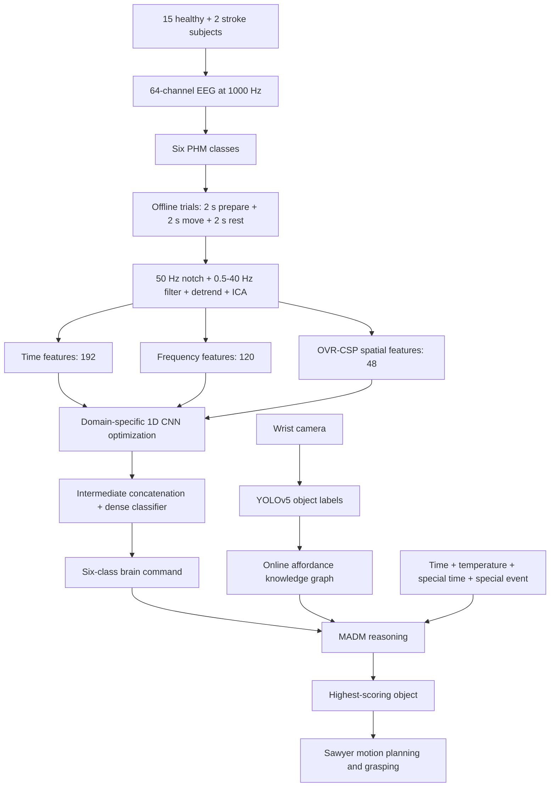

# information

|   |   |
|---|---|
|Title|A Novel Grasping Robot Control Method Using Motion Execution BCI Combining Knowledge Reasoning|
|Author|Rui Li; Jing Liu; Jinli Liu; Shiqiang Yang; Weiping Liu; Ke Deng; Wen Wang|
|Journal|IEEE Journal of Biomedical and Health Informatics|
|Year|2026|
|DOI|[10.1109/JBHI.2025.3622255](https://doi.org/10.1109/JBHI.2025.3622255)|

# abstract

> Recently, with the growing number of disabled people, brain-controlled technology offers a novel way to help patients restore their daily abilities. However, the conventional brain-controlled system based on the motion related task lacks intelligence in real-world environments. To address above problem, this study proposed a share-controlled system combining a precise hand movement (PHM)-based brain computer interface (BCI) system and knowledge-driven reasoning method. Six types of precise hand movements were selected to design novel motion execution paradigm for BCI system. A feature intermediate fusion convolutional neural network was employed to accurately decode electroencephalogram. Furthermore, a shared control grasping technology based on knowledge-based reasoning combined PHM-based BCI system was designed for grasping robot, which enhancing the system's intelligence and versatility in selecting objects. To verify the improvement of proposed method, experiments were conducted with 15 healthy subjects and 2 patients. The proposed method achieved an average accuracy of 82.80 ± 6.08%, with the highest accuracy reaching 94.27%. All the experimental results demonstrate the effectiveness of the proposed shared control method.

近年来,随着残障人士数量增加,脑控技术为帮助患者恢复日常生活能力提供了一条新途径. 然而,基于运动相关任务的传统脑控系统在真实环境中缺乏智能性. 为解决这一问题,本研究提出一种共享控制系统,将基于精细手部动作(PHM)的脑机接口(BCI)与知识驱动推理方法相结合. 研究选取6类精细手部动作,为BCI系统设计了一种新的运动执行范式,并采用特征中间融合卷积神经网络对脑电信号进行准确解码. 此外,研究为抓取机器人设计了一种将知识推理与PHM-BCI结合的共享控制技术,以提高系统选择物体时的智能性和灵活性. 研究在15名健康受试者和2名患者中开展实验,所提方法的平均准确率为82.80 ± 6.08%,最高准确率达到94.27%. 全部实验结果表明了该共享控制方法的有效性.

# workflow

The system first decodes one of six executed hand movements from EEG. It then combines that command with objects detected in the scene and contextual knowledge, allowing the same brain command to select different targets under different conditions. The offline experiment evaluates the paradigm and decoder, whereas the online experiment tests the complete perception-reasoning-grasping loop.

系统首先从EEG中解码6类实际执行的手部动作之一,随后将该指令与场景中的物体检测结果及情境知识结合,从而使同一条脑控指令能够在不同条件下选择不同目标. 离线实验用于评估范式和解码器,在线实验则验证完整的感知-推理-抓取闭环.

# core method

## 1. From direct mapping to shared control

A conventional motor BCI commonly maps each decoded class directly to one device command. This is easy to implement but scales poorly: selecting more objects requires more reliably distinguishable mental tasks. The paper instead separates *intent decoding* from *target selection*. EEG supplies a coarse hand-action intention, while environmental perception and knowledge reasoning refine it into a concrete object. The key contribution is therefore not merely adding classes, but increasing the meaning carried by each class.

传统运动BCI通常把每个解码类别直接映射为一条设备指令. 这种方案容易实现,但扩展性较差,因为选择更多物体就需要更多能够被可靠区分的心理任务. 本文将意图解码与目标选择分离: EEG提供较粗粒度的手部动作意图,环境感知和知识推理再将其细化为具体物体. 因此,该工作的关键并不只是增加类别数量,而是提高每个类别能够承载的语义量.

## 2. Precise hand movement paradigm

The precise hand movement paradigm contains right and left palmar grasp, pointing, and lateral grasp, producing six classes in total. EEG was recorded from 64 channels at 1000 Hz, after which 24 electrodes over frontal, central, and centroparietal areas were selected for decoding. Each class contained 18 sessions of 10 trials, and every trial consisted of 2 s preparation, 2 s movement, and 2 s rest. This yielded 180 trials per movement for each participant. Fifteen healthy participants completed offline and online experiments, while two men with ischemic stroke joined only the offline experiment.

精细手部动作范式包括左手和右手的掌握,指点与侧握,共形成6个类别. EEG以1000 Hz从64个通道采集,随后选取额区,中央区和中央顶区的24个电极进行解码. 每类动作包含18个session,每个session有10个trial,每个trial依次包括2 s准备,2 s动作和2 s休息,因此每位受试者的每类动作共有180个trial. 15名健康受试者参加离线和在线实验,2名缺血性脑卒中男性患者仅参加离线实验.

## 3. Feature intermediate fusion CNN

After a 50 Hz notch filter, a 0.5-40 Hz fourth-order Butterworth filter, detrending, and ICA-based muscle-artifact removal, the method constructs three complementary representations. The time branch uses eight statistics from each of 24 channels, the frequency branch uses the power spectral density of five rhythms, and the spatial branch uses one-versus-rest common spatial patterns. Their input sizes are shown below.

经过50 Hz陷波,0.5-40 Hz四阶Butterworth滤波,去趋势和基于ICA的肌电伪迹去除后,方法构造3种互补表征. 时域分支从24个通道分别提取8个统计特征,频域分支提取5种节律的功率谱密度,空间分支采用one-versus-rest common spatial pattern. 各分支输入维度如下.

|Feature branch|Construction|Input size|
|---|---|---:|
|Time|8 statistics × 24 channels|192 × 1|
|Frequency|5 band powers × 24 channels|120 × 1|
|Spatial|6 OVR-CSP filters × 8 features|48 × 1|

Each feature family first passes through its own 1D CNN optimization branch. The learned representations are then concatenated and classified jointly by dense layers. In compact form, the fusion and prediction stages are:

每类特征先通过独立的1D CNN优化分支,学习到的表征随后被拼接,再由dense layer联合分类. 融合与预测过程可简写为:

$$
\mathbf{z}=\operatorname{Concat}\left(\phi_t(\mathbf{x}_t),\phi_f(\mathbf{x}_f),\phi_s(\mathbf{x}_s)\right),\qquad
\widehat{\mathbf y}=\operatorname{Softmax}\left(\mathbf{W}\mathbf{z}+\mathbf{b}\right)
$$

This is "intermediate fusion" because the domains interact before the final class decision. The comparison FPF-CNN instead lets each branch make a class prediction and only then combines the outputs by voting. FIF-CNN can therefore learn cross-domain correlations and suppress redundant features rather than merging already-compressed decisions.

这里的中间融合是指不同域在最终分类决策之前发生交互. 对比方法FPF-CNN则先让每个分支独立输出类别,再通过投票合并结果. 因此,FIF-CNN能够学习跨域相关性并抑制冗余特征,而不是只合并已经被压缩的分类结论.

## 4. Knowledge reasoning for object selection

The robot's wrist camera detects visible objects with YOLOv5, and these labels instantiate an online knowledge graph derived from an offline affordance graph. Palmar grasp is associated with graspable objects, pointing with pressable objects, and lateral grasp with scoop-like actions on soft curved objects. A multiple-attribute decision-making module then scores candidates using brain intention, special events, special time points, temperature, and time, with weights of 0.40, 0.25, 0.15, 0.10, and 0.10, respectively. The Sawyer robot grasps the candidate with the highest converted probability.

机器人腕部相机使用YOLOv5检测可见物体,并利用这些标签从离线affordance图谱实例化在线知识图谱. 掌握对应可被手掌抓取的物体,指点对应可按压物体,侧握对应对柔软曲面物体的舀取动作. 多属性决策模块再根据脑控意图,特殊事件,特殊时间点,温度和时间对候选物体评分,其权重依次为0.40,0.25,0.15,0.10和0.10. Sawyer机器人最终抓取转换后概率最高的候选物体.

The practical innovation lies in contextual reuse of commands. For example, the same decoded palmar-grasp intention may lead to a cup when water is needed or a banana under another context. This turns a fixed one-command-one-object interface into a one-command-many-objects policy without asking the EEG classifier to distinguish every object directly.

该设计的实用创新在于根据情境复用指令. 例如,同一条被解码的掌握意图在缺水情境下可以指向水杯,在另一种情境下则可以指向香蕉. 这样无需让EEG分类器直接区分每个物体,就能把固定的一指令一物体接口扩展为一指令多物体策略.

# result

## 1. Offline physiological and decoding results

sLORETA analysis found separable cortical responses and ERD/ERS patterns in frontal, parietal, and sensorimotor regions for both healthy participants and stroke patients, although the patient response amplitude was lower. With a conventional CNN, spatial features were the strongest single domain at 76.48 ± 5.16%, compared with 63.92 ± 8.49% for frequency features and 59.60 ± 9.20% for time features.

sLORETA分析显示,健康受试者和脑卒中患者在额区,顶区和感觉运动区均出现具有可分性的皮层响应以及ERD/ERS现象,但患者的响应幅度更低. 使用传统CNN时,空间特征是表现最好的单一域,准确率为76.48 ± 5.16%,频域和时域特征则分别为63.92 ± 8.49%和59.60 ± 9.20%.

Using 10-fold cross-validation repeated four times, FIF-CNN reached 82.80 ± 6.08% mean accuracy, a Kappa coefficient of 0.79, and an information transfer rate of 54.60 ± 10.52 bits/min. It exceeded EEGConformer by 2.11 percentage points and FPF-CNN by 5.82 points; the one-way ANOVA reported a significant difference among the three algorithms. Two representative participants reached the table's maximum of 94.72%.

在重复4次的10折交叉验证中,FIF-CNN取得82.80 ± 6.08%的平均准确率,0.79的Kappa系数以及54.60 ± 10.52 bits/min的信息传输率. 它比EEGConformer高2.11个百分点,比FPF-CNN高5.82个百分点,单因素ANOVA显示3种算法之间存在显著差异. 表格中2名代表性受试者的最高准确率为94.72%.

|Method|Accuracy|Kappa|ITR (bits/min)|
|---|---:|---:|---:|
|FPF-CNN|76.98 ± 6.71%|0.72|48.84 ± 9.16|
|EEGConformer|80.69 ± 5.16%|0.77|52.28 ± 9.68|
|FIF-CNN|82.80 ± 6.08%|0.79|54.60 ± 10.52|

The paper computes ITR with six classes and a 2 s decision interval:

论文使用6个类别和2 s决策间隔计算ITR:

$$
\operatorname{ITR}=\frac{60}{T}\left[\log_2 N+P\log_2 P+(1-P)\log_2\left(\frac{1-P}{N-1}\right)\right]
$$

Here, $N$ is the number of classes, $P$ is classification accuracy, and $T$ is the trial duration in seconds. One internal inconsistency should be noted: the abstract reports a maximum of 94.27%, whereas Table 6, the Results section, and the Conclusion report 94.72%.

其中,$N$表示类别数,$P$表示分类准确率,$T$表示以秒为单位的trial时长. 需要注意一处内部不一致: 摘要中的最高准确率为94.27%,而Table 6,Results和Conclusion均写为94.72%.

## 2. Online grasping results

Fifteen healthy participants each completed eight online grasping trials involving a pear, apple, fruit knife, water bottle, cell phone, remote control, cup, and spoon. Mean online EEG accuracy was 70.00 ± 15.53%; the paper also reports 5.4 ± 1.35 correctly grasped objects out of eight, with the best participants reaching 87.5%. These results demonstrate a working end-to-end prototype, but online performance was clearly lower and more variable than offline cross-validation.

15名健康受试者分别完成8次在线抓取,目标包括梨,苹果,水果刀,水瓶,手机,遥控器,水杯和勺子. 在线EEG平均准确率为70.00 ± 15.53%; 论文还报告每8个物体中正确抓取5.4 ± 1.35个,最佳受试者达到87.5%. 这些结果证明端到端原型能够运行,但在线表现明显低于离线交叉验证,个体间波动也更大.

## 3. Interpretation and limitations

The strongest result is the integration of three layers: a six-class executed-movement BCI, intermediate multi-domain feature fusion, and context-aware object reasoning. The decoder improvement over EEGConformer is useful but modest; the larger conceptual gain is that knowledge reasoning expands what a small command set can accomplish. This is a promising direction for assistive robotics because it allocates low-level perception and target disambiguation to the machine while retaining human intent at the center of control.

本文最有力的结果是把3个层次整合起来: 6分类运动执行BCI,多域特征中间融合以及情境感知的物体推理. 解码器相对EEGConformer的提升具有价值但幅度有限,更重要的概念性收益是知识推理扩展了少量指令可以完成的任务范围. 对辅助机器人而言,这种设计很有前景,因为机器负责底层感知和目标消歧,同时仍以人的意图作为控制核心.

The evidence is still preliminary. Only two stroke patients were included, both only offline; the online cohort contained 14 men and one woman; each participant performed only eight online trials; and no subject-independent evaluation was reported. The study also does not isolate the contribution of knowledge reasoning with an online ablation or a direct-mapping baseline. Finally, the 64-channel recording systems and the large Sawyer robot are expensive and difficult to deploy in a ward. Larger, gender-balanced patient studies with portable hardware and longer real-world tasks are needed before clinical utility can be claimed.

现有证据仍处于初步阶段. 研究仅纳入2名脑卒中患者,且两人只参加离线实验; 在线队列由14名男性和1名女性组成; 每位受试者仅完成8次在线trial; 论文也没有报告跨受试者评估. 此外,研究没有通过在线消融实验或直接映射基线单独量化知识推理的贡献. 最后,64通道采集系统和大型Sawyer机器人价格较高,难以直接部署到病房. 在声称具备临床实用性之前,仍需使用便携设备,在规模更大且性别更均衡的患者群体中开展持续时间更长的真实环境实验.
