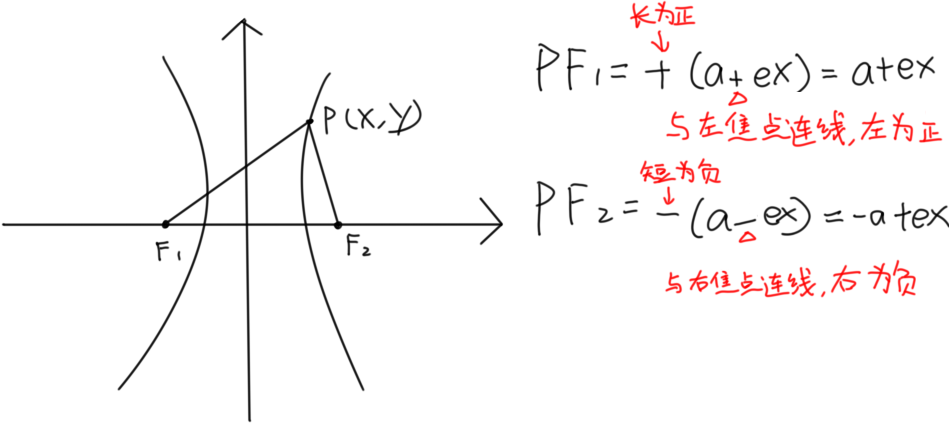
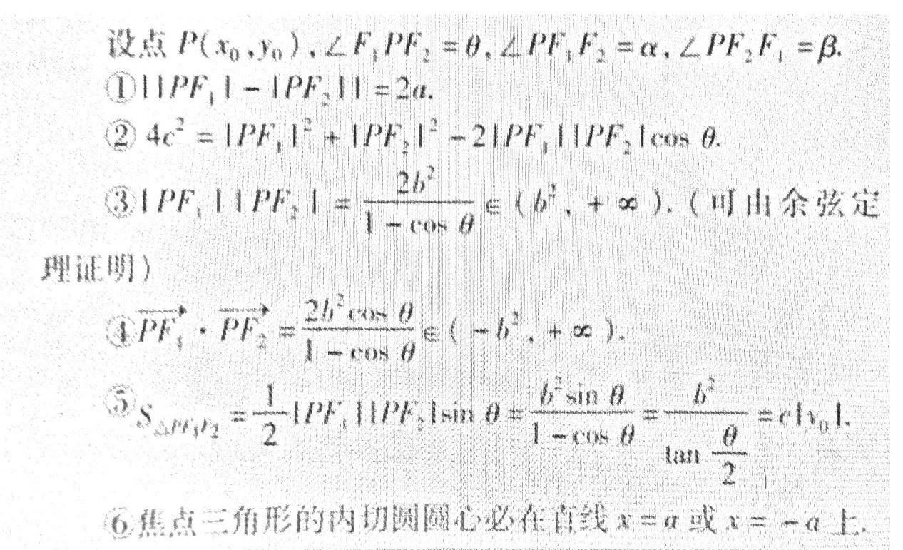
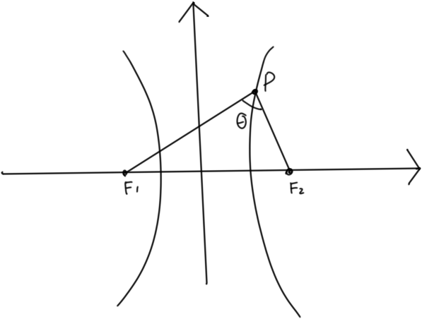
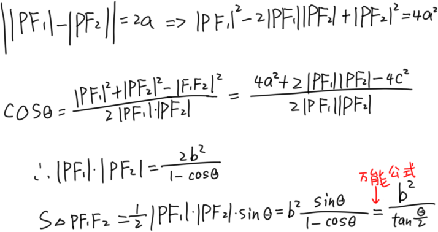
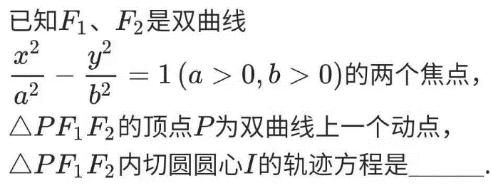
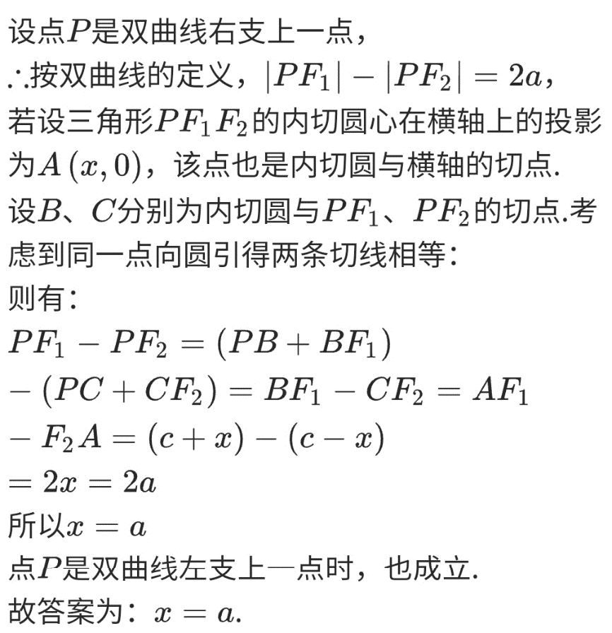
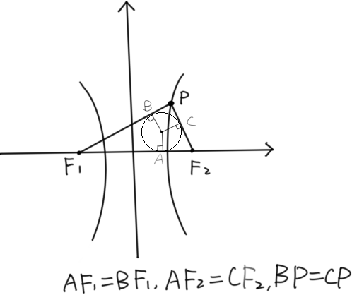
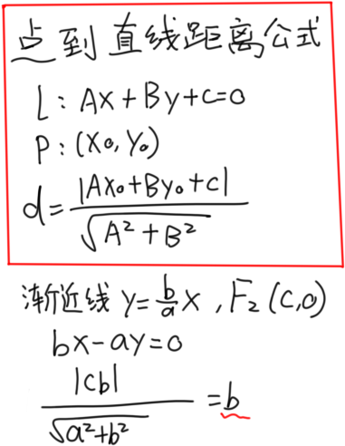

双曲线入门

# 两种特殊的双曲线

①等轴双曲线：实半轴与虚半轴相等，a=b

②共轭双曲线：一条双曲线的实轴与虚轴是另外一条双曲线的虚轴与实轴，那么他们俩是共轭双曲线

性质：\<1\>有共同的渐近线 \<2\>四个焦点共圆
\<3\>他们离心率倒数的平方和为1

# 双曲线的焦半径

双曲线上任一点P(x,y)到F1，F2的距离

★口诀：左(下)为正，右(上)为负；长为正，短为负

解释&例子

前半段是a±ex（±根据P与左右焦点哪一个连线决定，x是P点横坐标

后半段是±(前半段式子)（±根据长短决定

# 一些推论

一些解释

⑤

⑥

# 焦点到渐近线的距离为b

