圆锥曲线：从入门到入门

# 焦点弦

对于左右圆锥曲线，焦点弦都满足

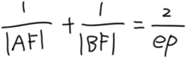

p是焦准距，准线到焦点的距离

e是离心率

# 抛物线设点

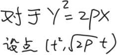

这样可以使一个点只有一个参数简化运算

# 圆锥曲线设线

1.恒过y轴上一点 y = kx + b

2.恒过x轴上一点 x = my + c

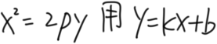

3.恒过x轴上一点且斜率已知存在 y = k ( x -- x0 )

4.恒过一定点( x0 , y0 ) y -- y0 = k ( x -- x0 )

若出现( y1 -- y0 )( y2 -- y0 ) 或 ( x1 -- x0 )( x2 -- x0 ) 或 (y1 -- yα
)( y2 -- yα ) 或 ( x1 -- xα )( x2 -- xα
)，知而不用，正常设线即可（如下图

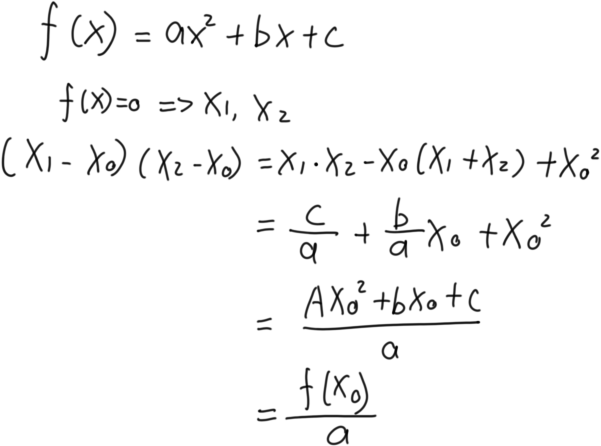

又如今年高考题

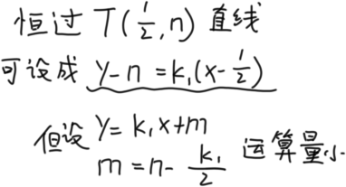

举一个小例子(手撕一下2021年高考题)

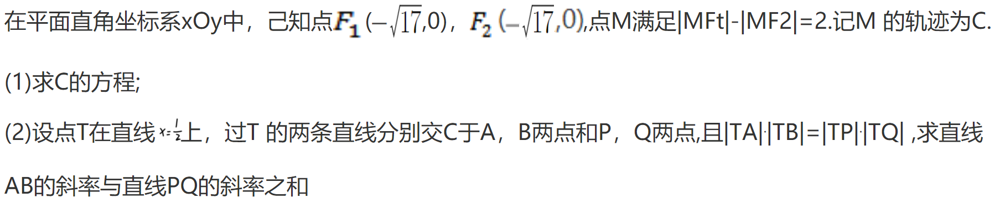

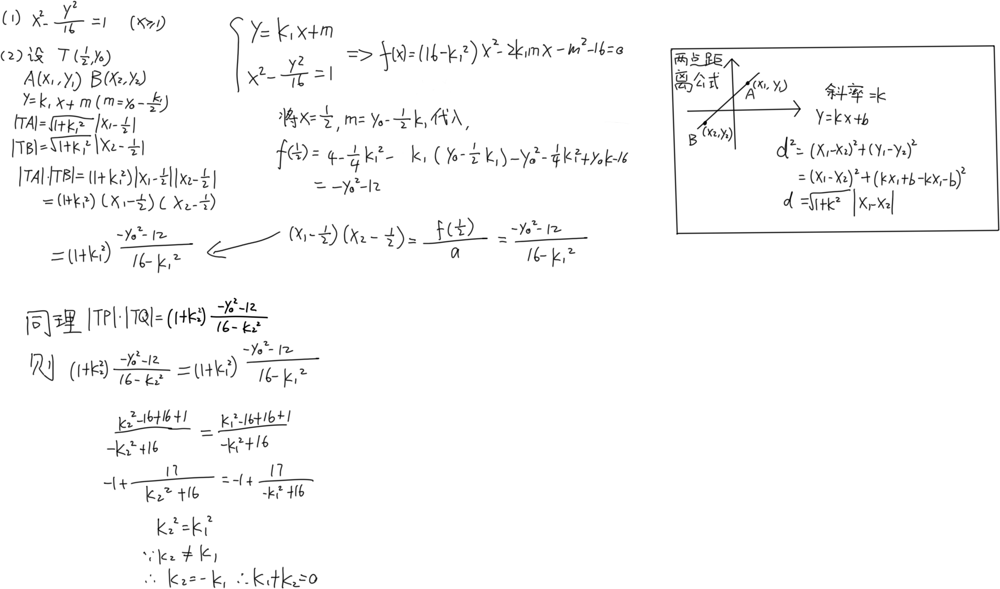

# 两点间距离公式

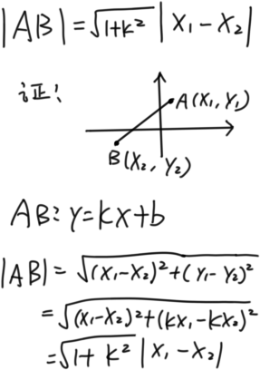

# 两点相切问题

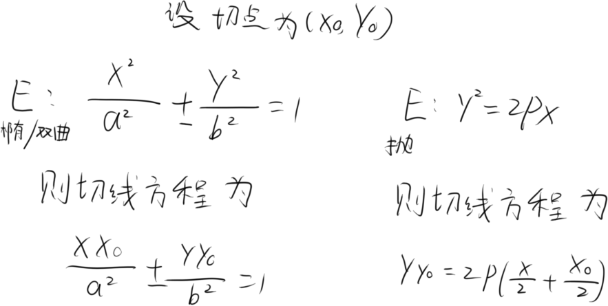

下面有请第一位受害者出场

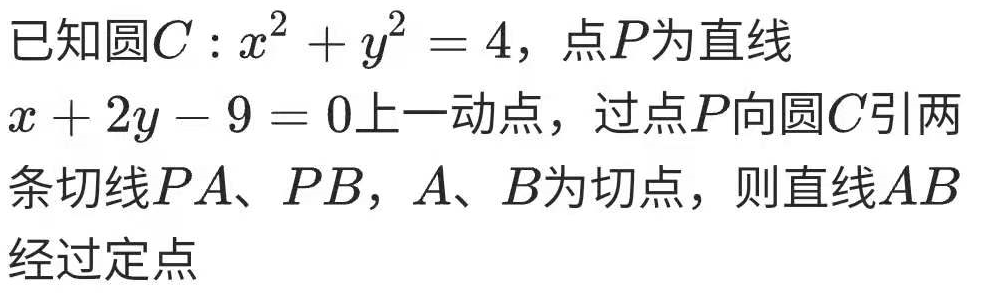

显然设点联立很难，所以

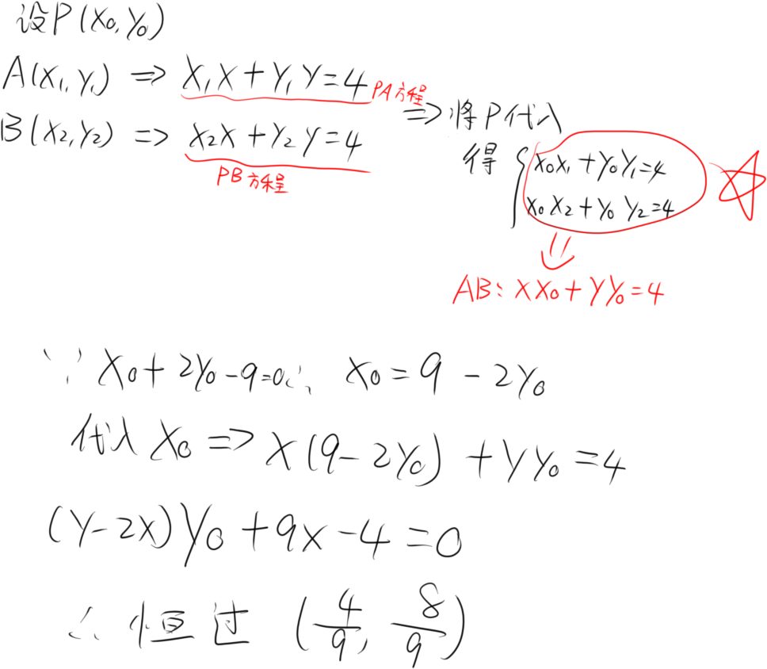

通过精妙的操作把AB直线用P坐标表示，再根据P的方程即可消到只剩一个参数

下面有请第二位受害者出场

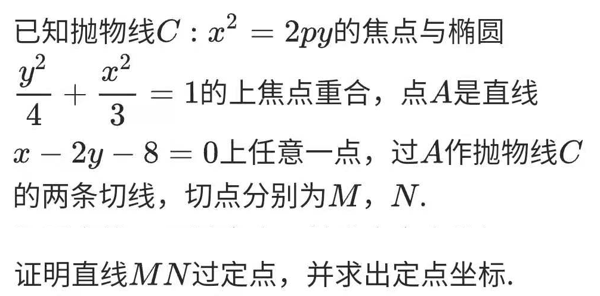

依然常龟操作即可

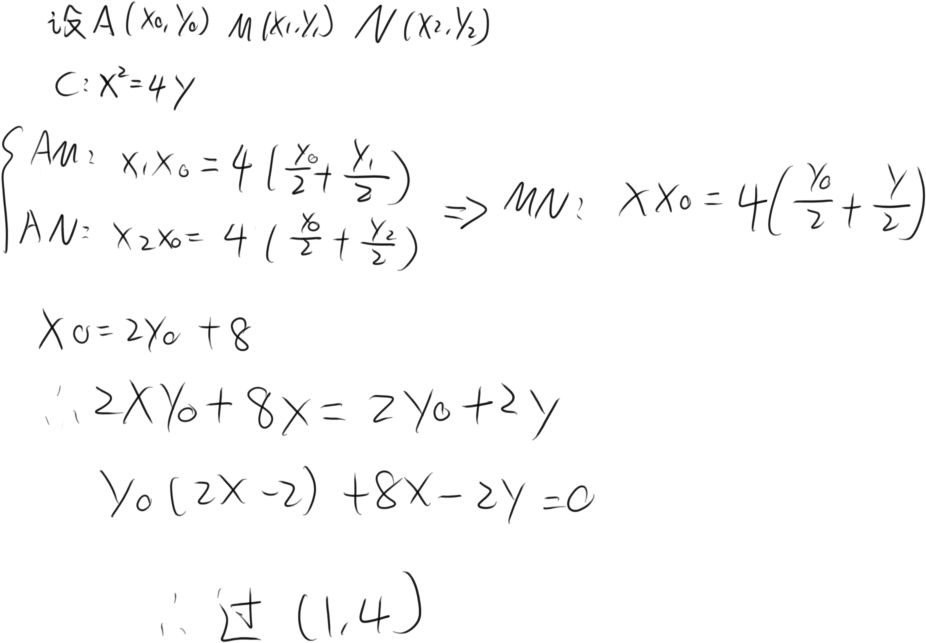

# 三jio函数设点(离谱

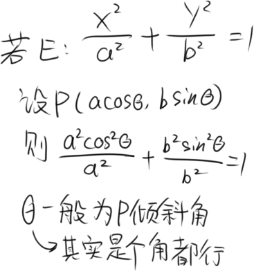

# 非对称的求解

有请受害者

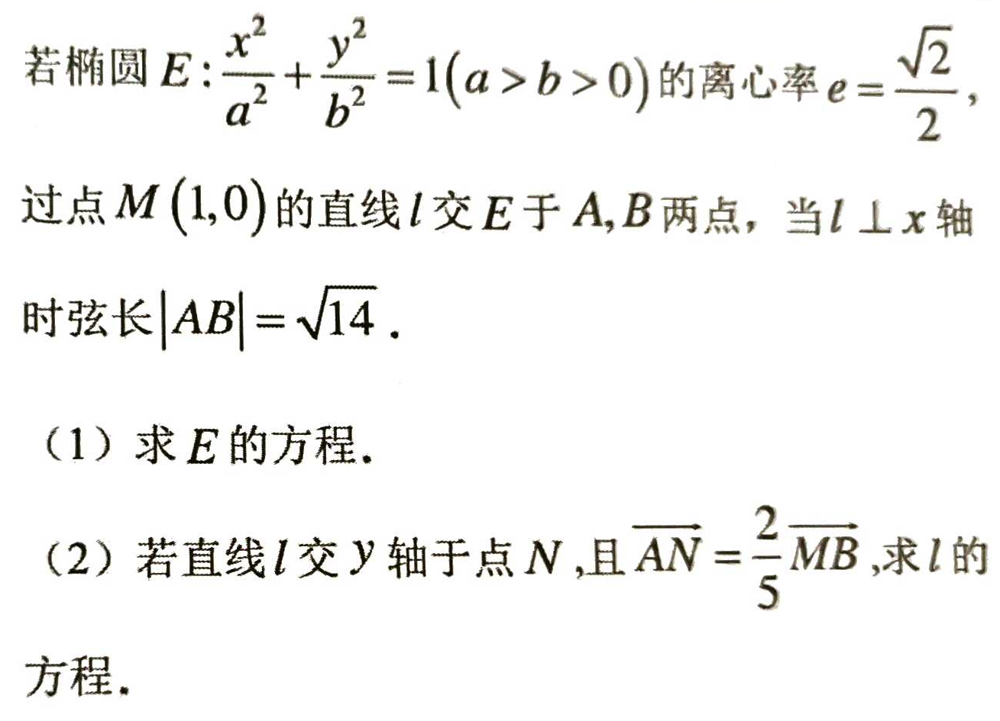

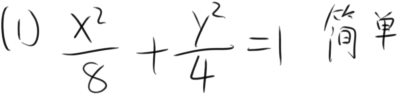

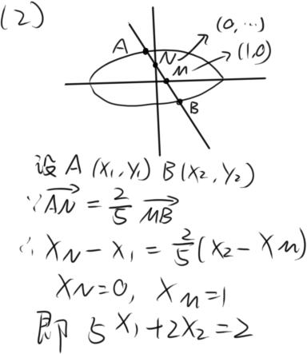

到了这步显然卡关了，因为正常操作都是带X₁+X₂，X₁和X₂系数相等，此时需要一个神奇的操作

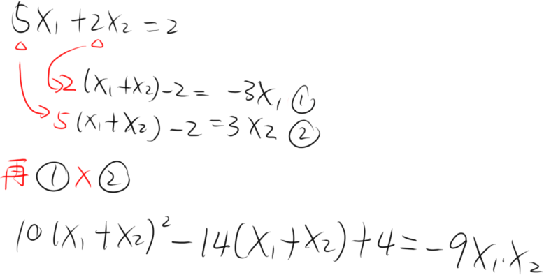

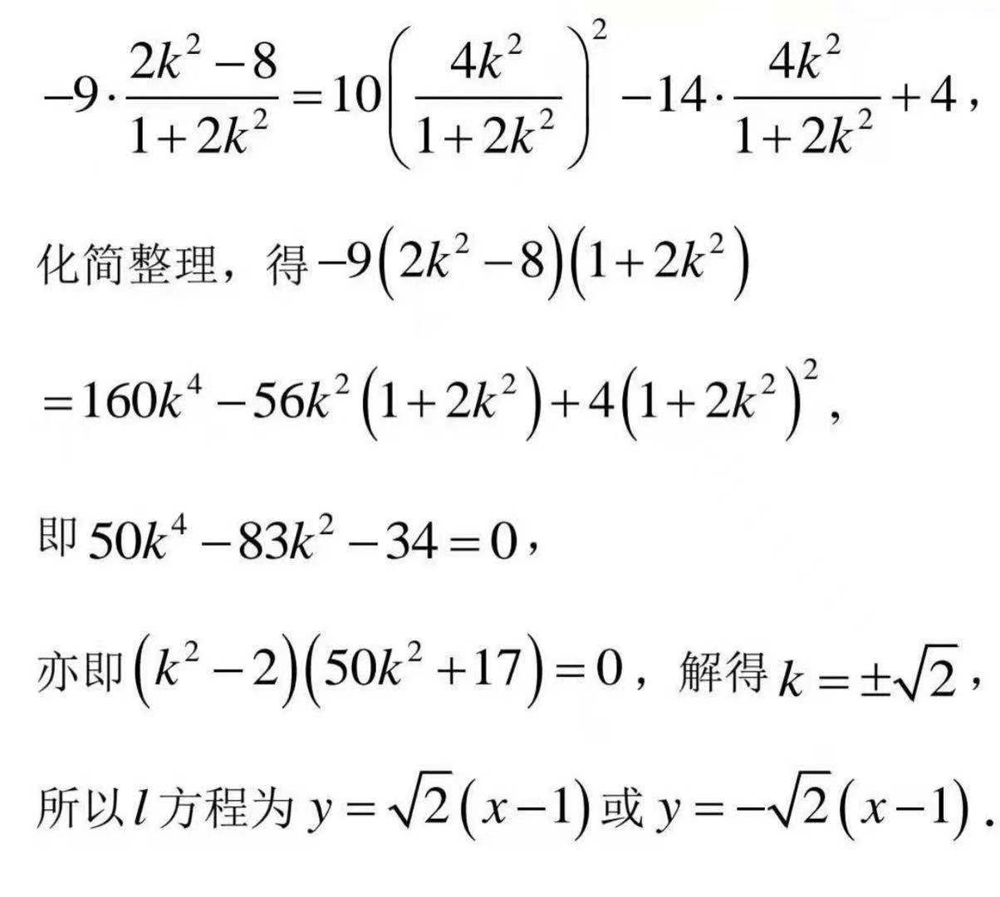

# 点差法&有心二次曲线的垂径定理

因为用点差法可以精妙地推出垂径定理，所以写在一块

有心二次曲线为椭圆，双曲线，圆

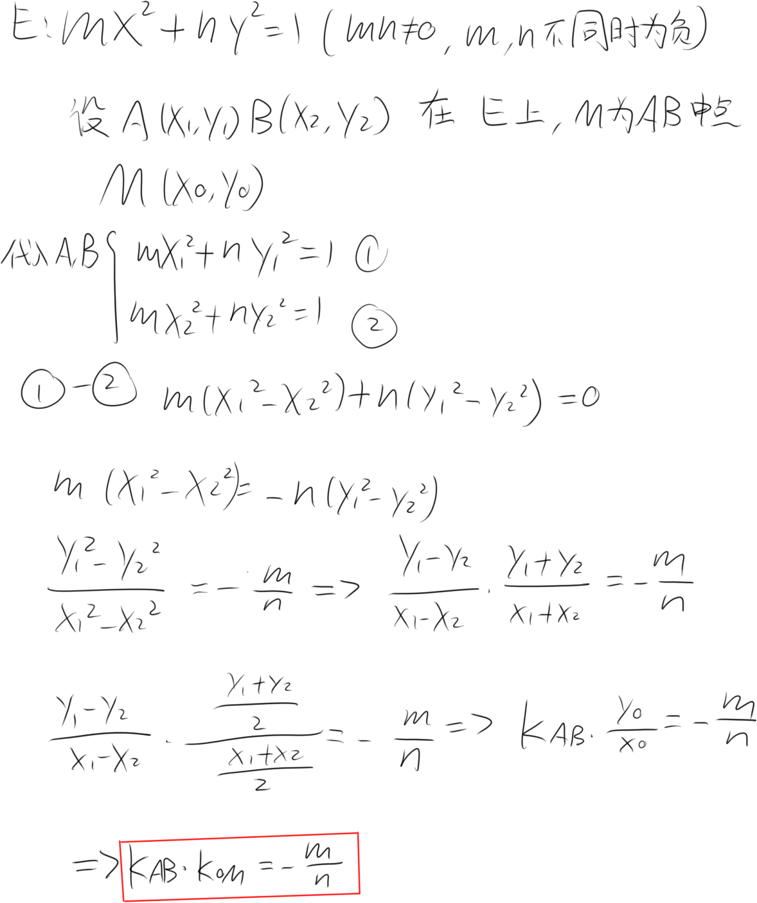

红框为有心二次曲线的垂径定理

涉及弦的中点可以用点差法

# 定比点差法

[点我!](https://vexpaer.github.io/2021/10/23/%E7%AE%80%E6%98%93%E5%B0%8F%E6%8A%80%E5%B7%A7-%E5%AE%9A%E6%AF%94%E7%82%B9%E5%B7%AE/)

# 椭圆的仿射变换

压缩坐标轴使椭圆成为圆

# 焦点三角形

# 斯特瓦尔特定理

# 调和点列
