抛物线入门

# 定义

平面上到定点F和到定直线l(l不经过点F)距离相等的点的轨迹叫做抛物线，点F叫做抛物线的焦点，直线l叫做抛物线的准线．

与椭圆和双曲线不同的是，在抛物线中，只有一个焦点和一条准线．

# 注意

(1)定义的实质可归结为"一动三定"，一个动点，设为M；一个定点F，叫做抛物线的焦点；一条定直线l，叫做抛物线的准线；一个定值，即点M到点F的距离和它到直线l的距离之比等于1.

(2)定点F不在定直线l上，否则动点M的轨迹不是抛物线，而是过点F垂直于直线l的一条直线．

(3)抛物线的定义中指明了抛物线上的点到焦点的距离与到准线距离的等价性，故二者可以相互转化．

# 标准方程&图形&数值

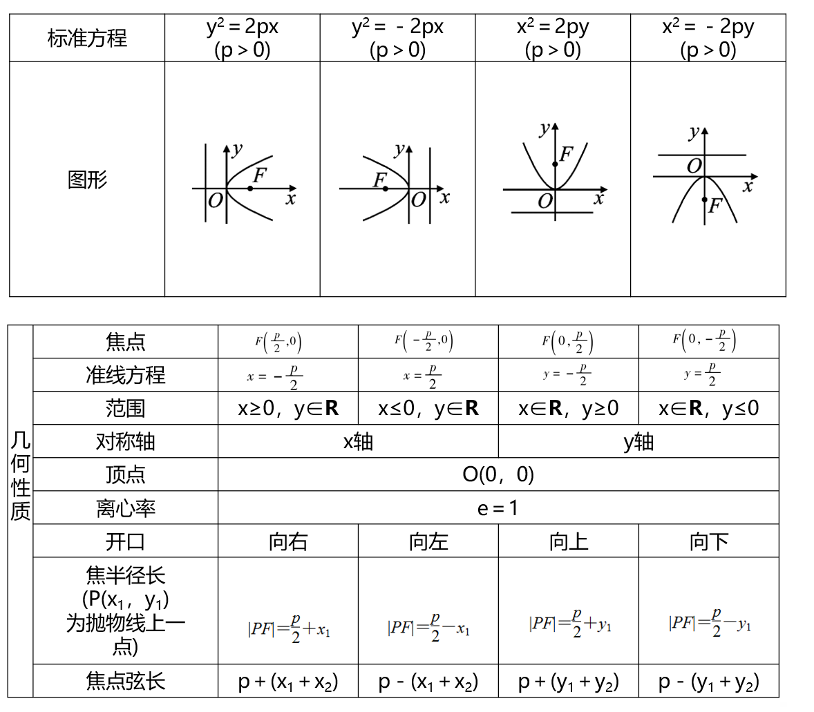

# 焦点弦

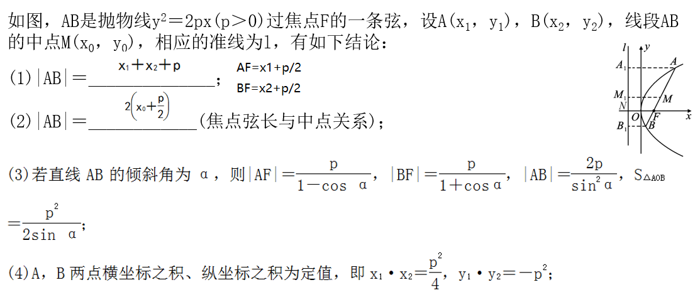

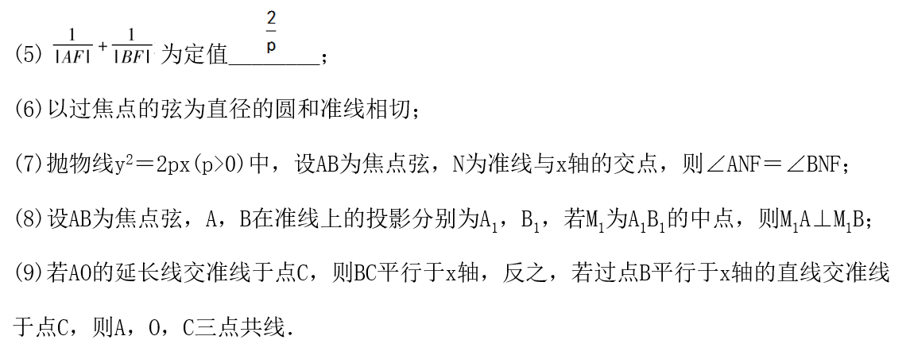

对于焦点弦の一些解释&证明

(1)

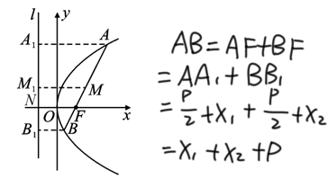

(3)

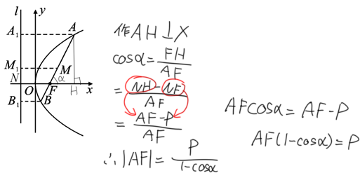

其余同理可证（看我这鱼摸得多光明正大

(4)设直线用坐标表示斜率，联立抛物线，韦达定理即可（欸嘿

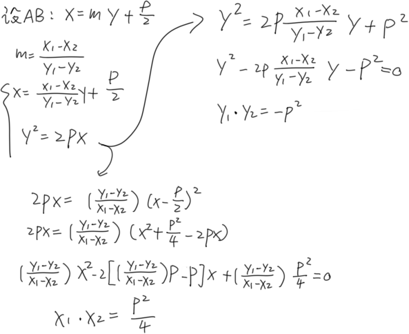

写完了发现好像设m就行不用表示出来（极度生草

(5)

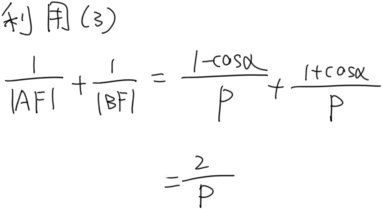

(6)

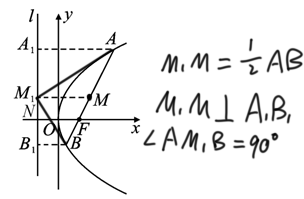

差不多就是这个意思，M1是相切的点（你懂吧，你懂

(7)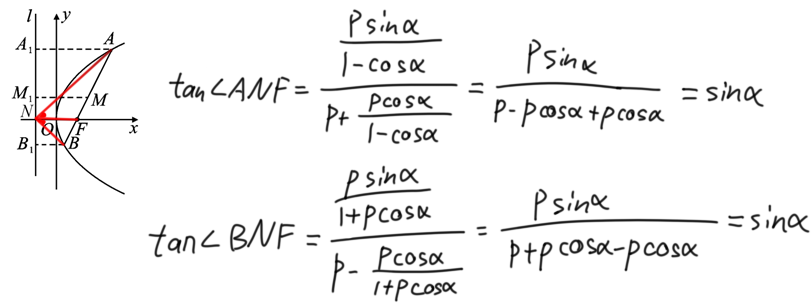

(8) 我 还 不 会

(9)

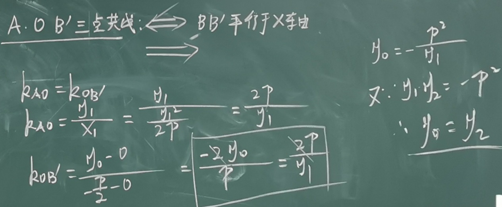

焦点弦22条结论

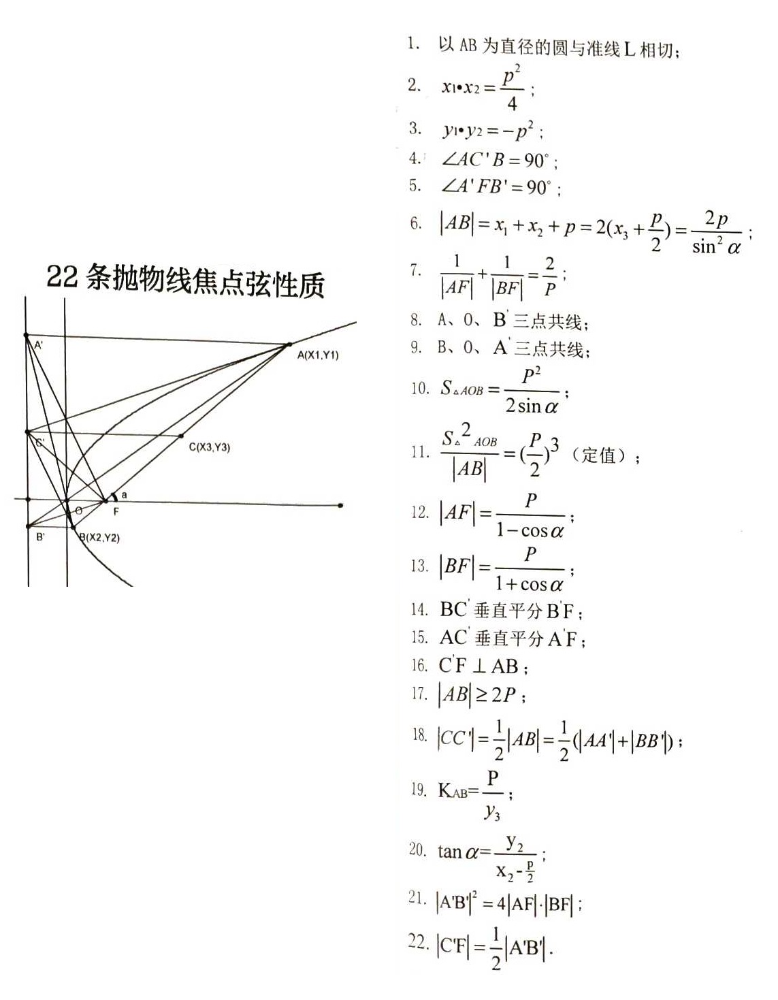

