椭圆

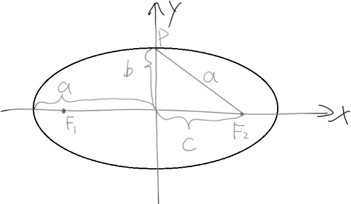
# 施法前摇

a：半长轴

b：半短轴

F1F2：焦距

c：焦距/2

根据勾股定理得知a²=b²+c²

# 第一定义

到平面内两个定点F1与F2的距离的和为一个常数(大于\|F1F2\|)的所有点的轨迹为椭圆

设M点的坐标为(x,y) , 椭圆P=

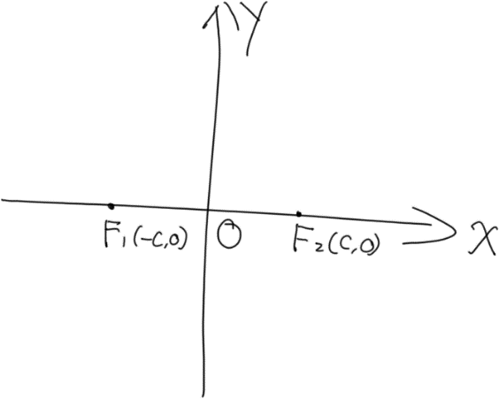
# 标准方程(焦点在x轴

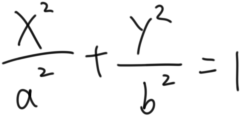

推导过程如下，已知

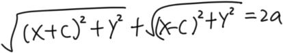

思路一：分子有理化

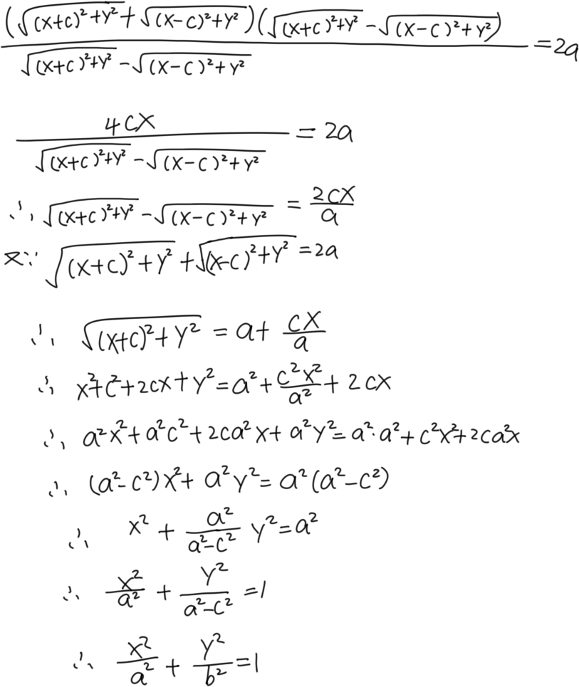~~好耶！wuhu take off~~!

思路二：移项

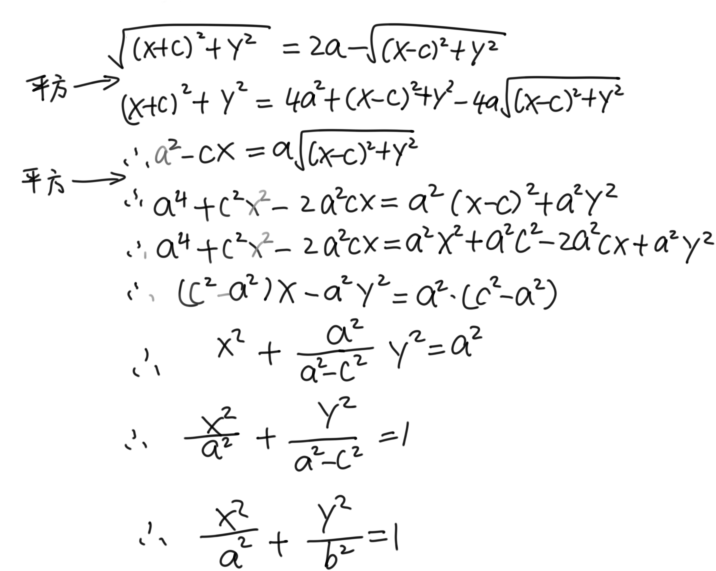~~这就是智慧（bu~~

# 第二定义

平面内一点到定点的距离与到定直线距离的比值是个常数e(0\<e\<1)

一些解释

1\. 定点为焦点F1，F2

2\. 定直线为对应的准线 x=a²/c与x=-a²/c

3\. 离心率e=c/a

推导

在第一定义移项的推导中，已经知道

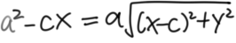~~（已经在往回翻了~~

那么

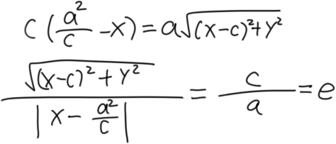

# 焦半径

椭圆上任意一点P与焦点连线的线段为焦半径

设P(x0,y0)为椭圆上一点，那么焦半径为\|PF1\|，\|PF2\|，且\|PF1\|=a+ex0，\|PF2\|=a-ex0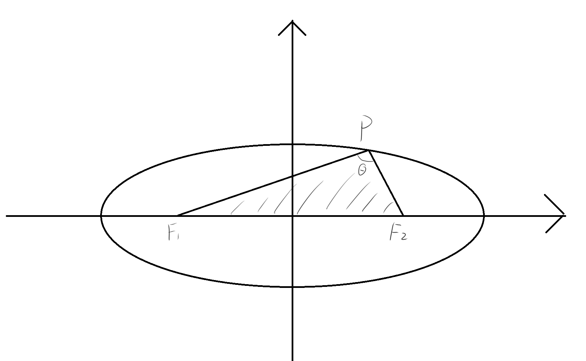

推导

思路一：第二定义

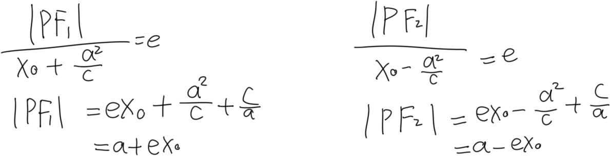

思路二：第一定义

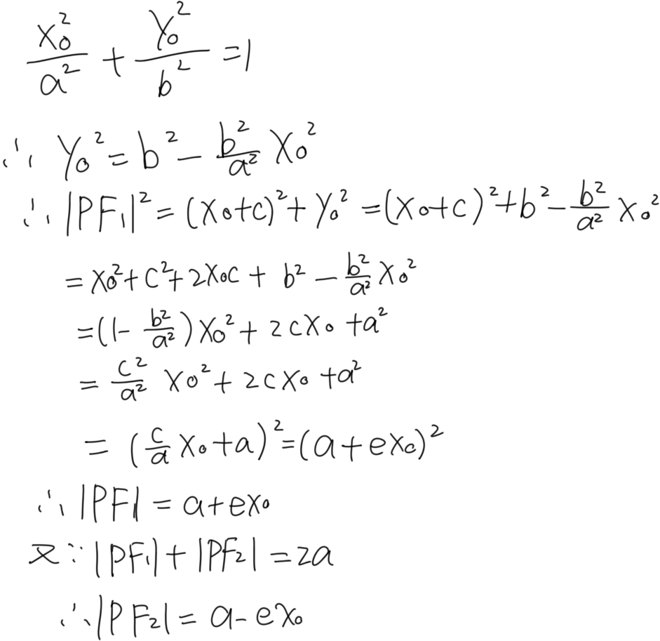

注意①

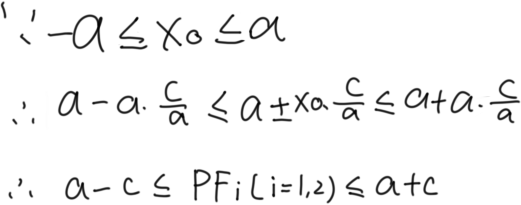

注意②

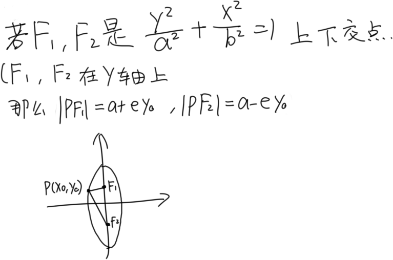

# 焦半径(倾斜角式

首先引入焦准距的概念，焦准距p=a²/c-c=b²/c，也就是准线到焦点的距离

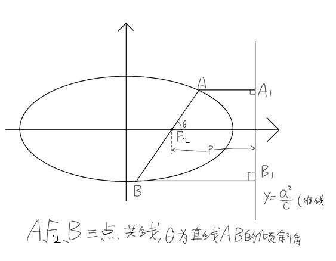看这精妙的图，然后就有如下操作

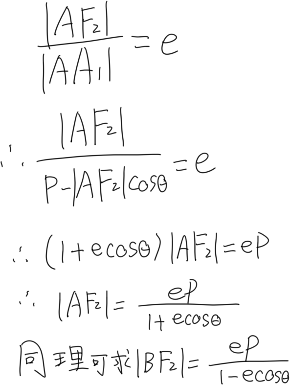 *这个骚操作之后又能求出\|AB\|*
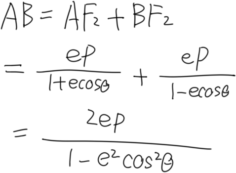

此时故事往两个方向发展

方向①

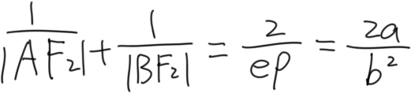 （是个感觉能用上的式子

方向② 当AB⊥x轴时， 倾斜角=0°，cos=0，此时\|AB\| = 2ep = 2 \* c/a \* b²/c
= 2 b²/a

此时线段AB也称为通径

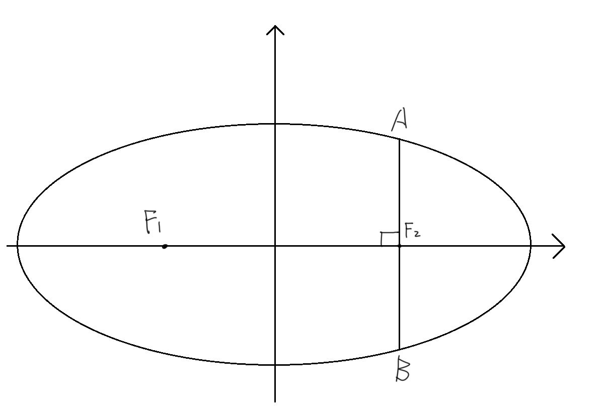

# 关于把焦点和椭圆上一点P连起来发生了奇怪的现象这档事

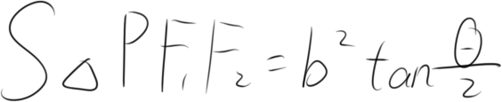

推导

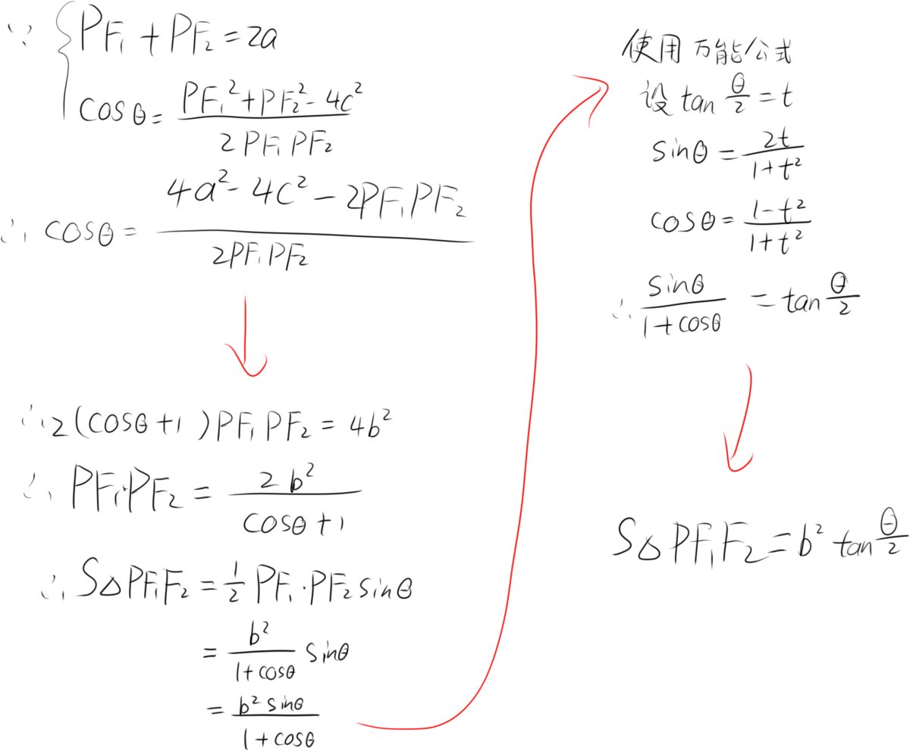

# 第三定义

平面内与两定点连线的斜率之积为常数(除-1外)的点的轨迹称为椭圆(不包括两定点)

说明：两定点并不是焦点，是椭圆交于X轴的两点(a,0)与(-a,0)

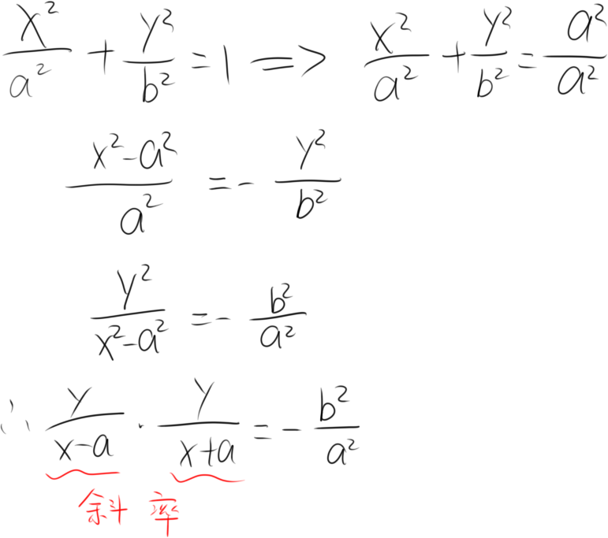

关于斜率的说明

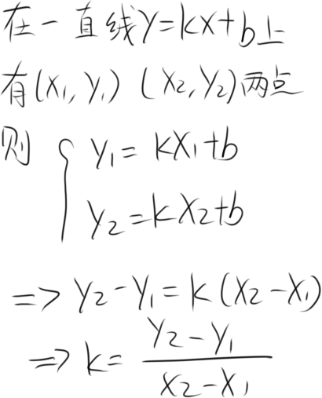

# 椭圆中的垂径定理

先说是啥

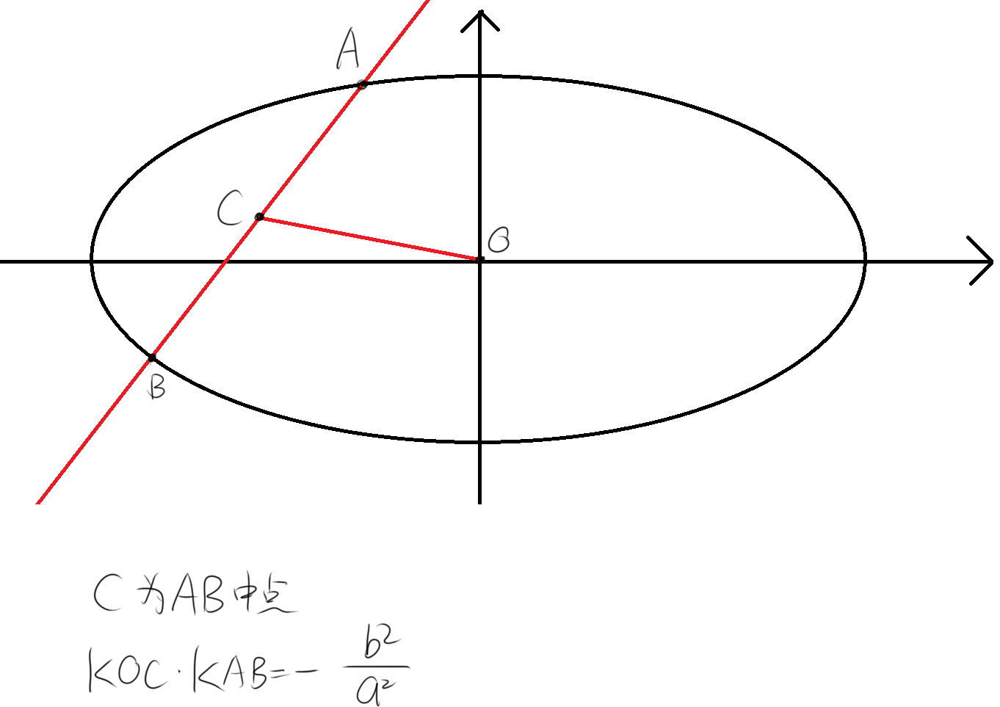

推导

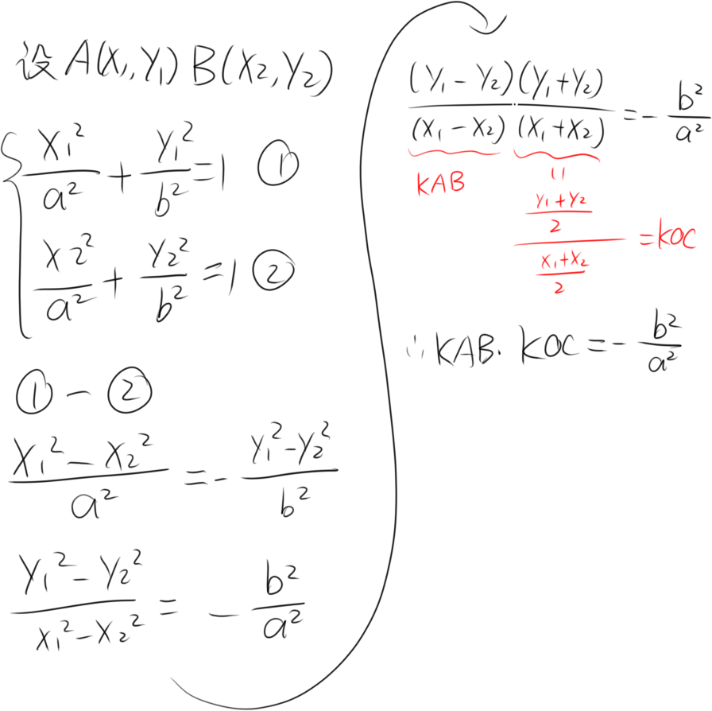

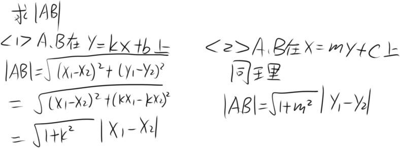
