定比点差法

# 基础芝士

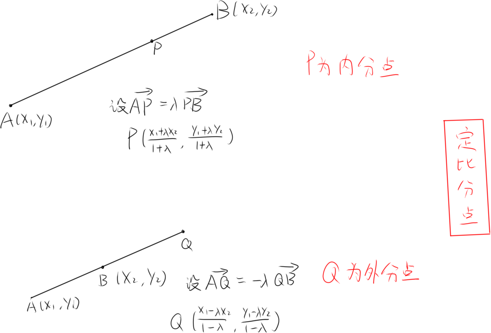

# 原理&适用情况

原理，利用定点P到弦与椭圆两交点A,B距离的关系λ，用A,B坐标与λ通过定比分点表示出P点坐标，并通过平方差公式用λ表示A,B两点坐标

此方法λ是否为定值不重要，λ不变(即AP与PB成比例)，与，λ变(即AP与PB比例不定)，这两种情况都适用，λ主要用于表示坐标

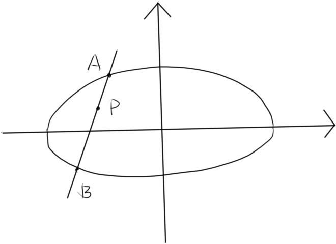

适用情况嘎嘎广泛，弦过一定点时可使用，将弦与椭圆交点作为A,B，定点作为内/外分点

# 步骤

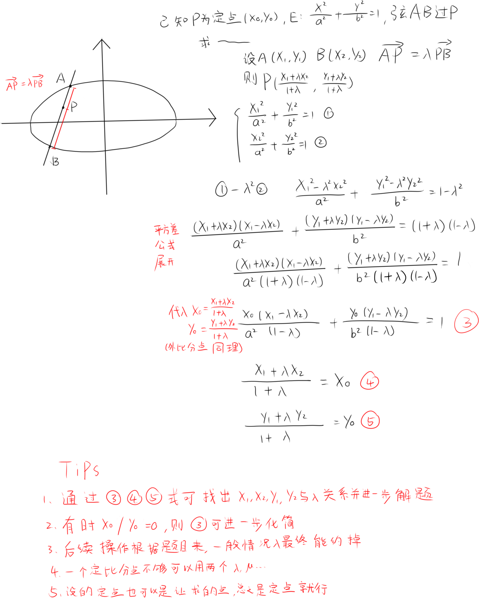

# 高级作战记录

Data.1.两组定比分点表示一个点坐标找等量关系

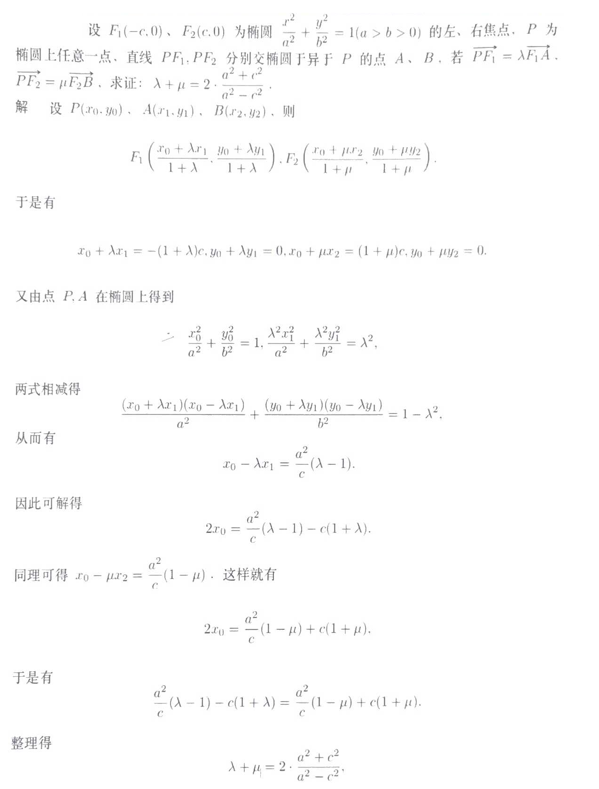

Data.2.不能说和上题一模一样,只能说比上一题还弱

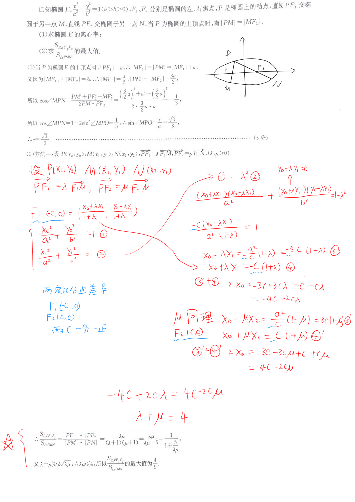

Data.3

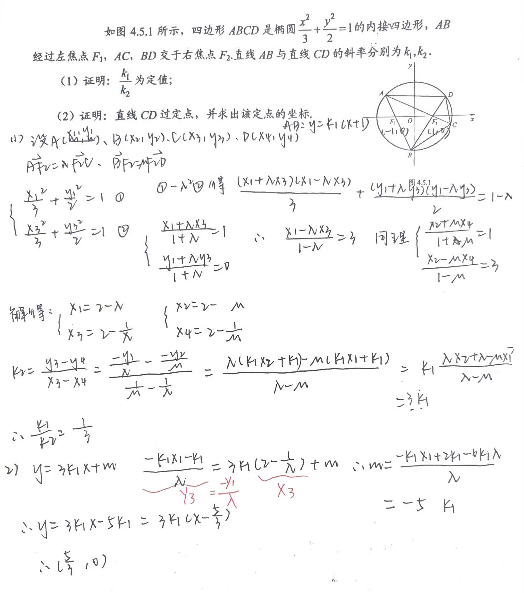

Data.4.定比点差计算量天花板，额外添加的一问和上一题思路一样哦\~

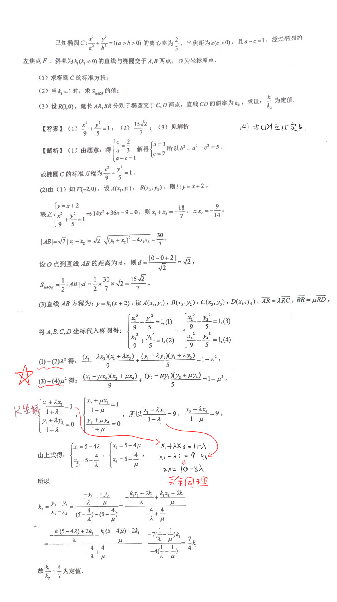

Data.5.展开一个平方差带进去两个定点坐标光速完事

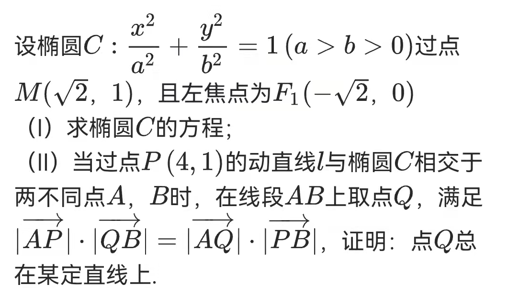

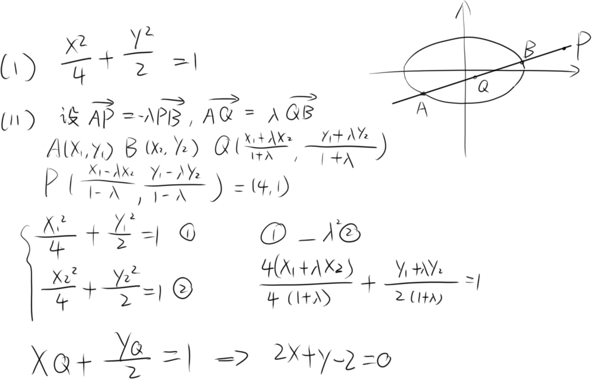

Data.6.两组定比分点，一已知一待求，带入一个平方差展开的式子

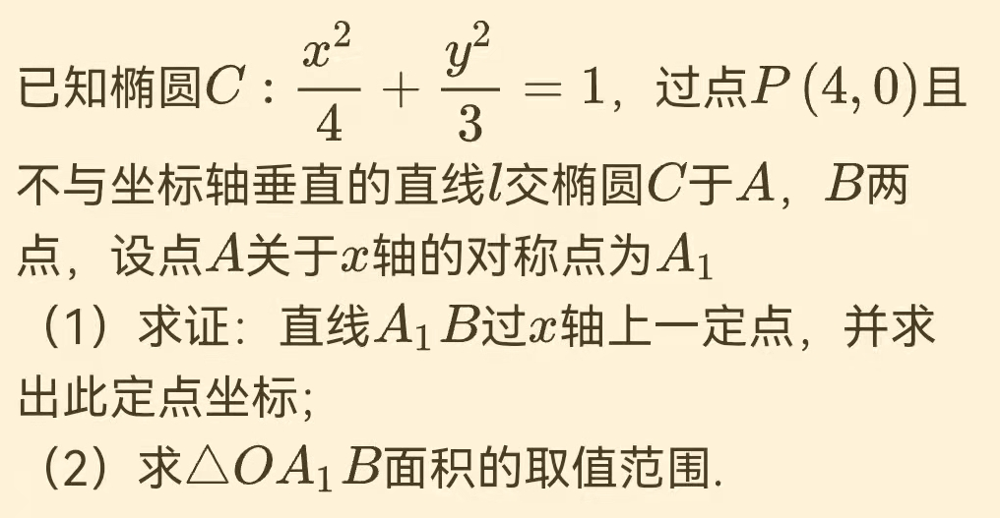

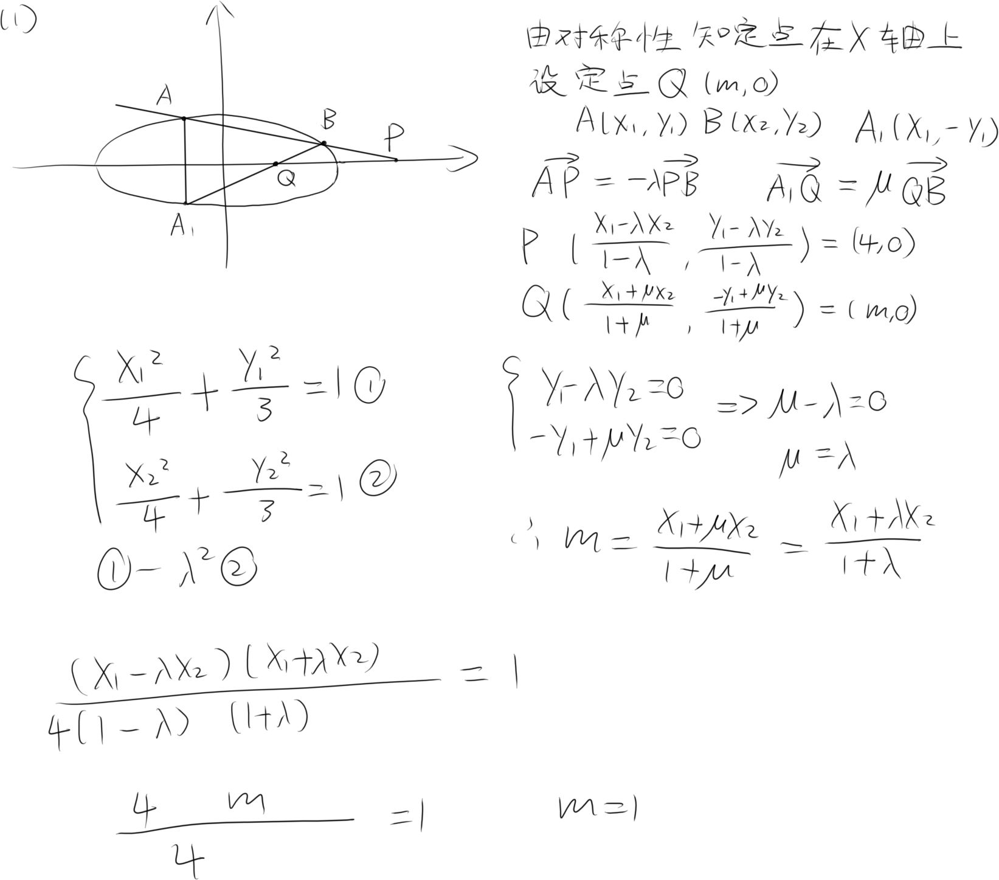

先挂第一问的一种解法，还有第一问的二解(只用P一个定比分点然后两点式算A1B过的定点，但是有点麻烦)，和第二问(这个简单韦达定理能秒出来)
