焦半径の倾斜角式

# 前置知识&推理

关于焦准距p

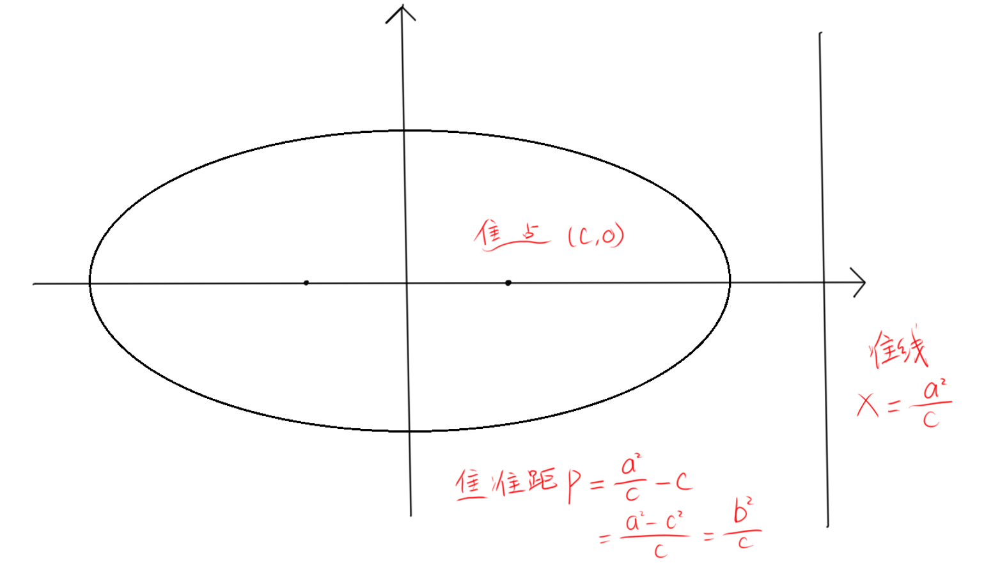

关于焦半径&焦点弦的倾斜角表示法

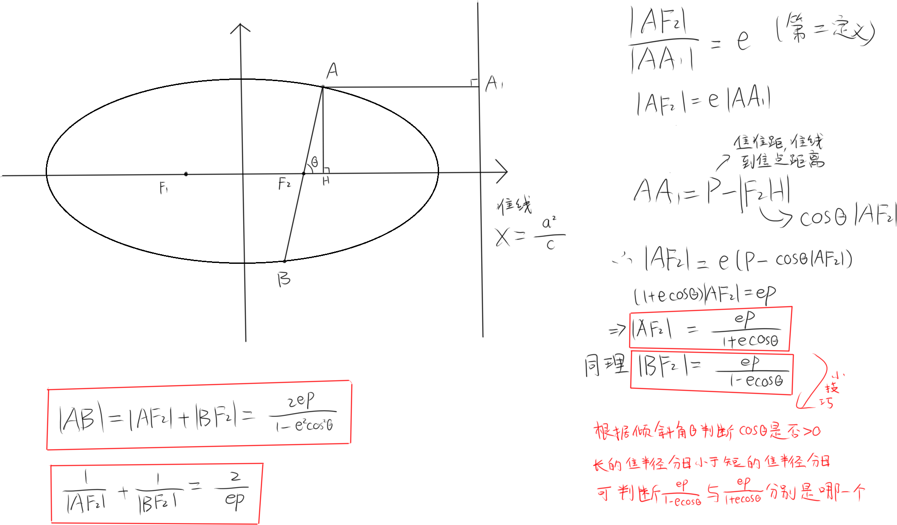

# 例题
以下所有题目都用焦半径的倾斜角式乱杀，但都不是唯一解法，主要是为了说明这个方法怎么用

T1

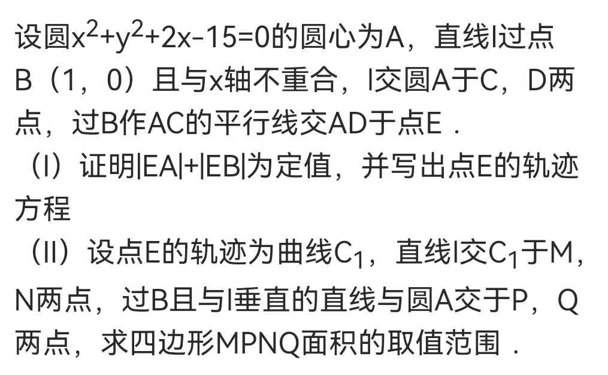

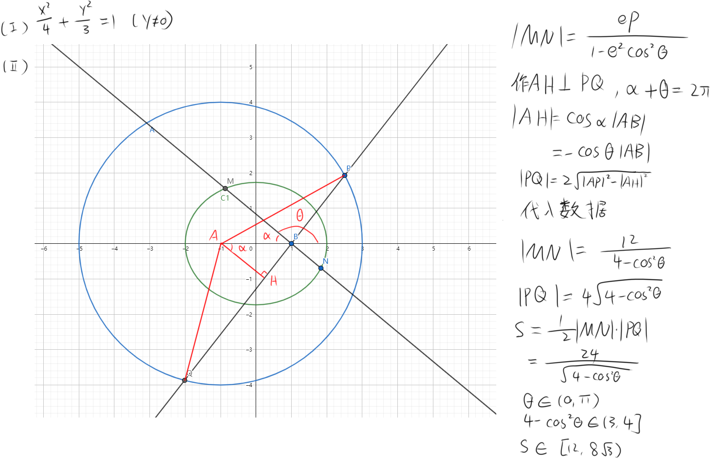

T2

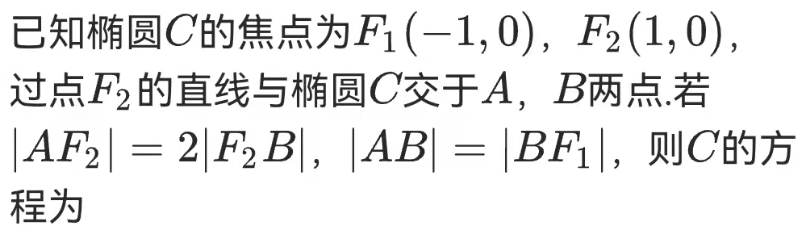

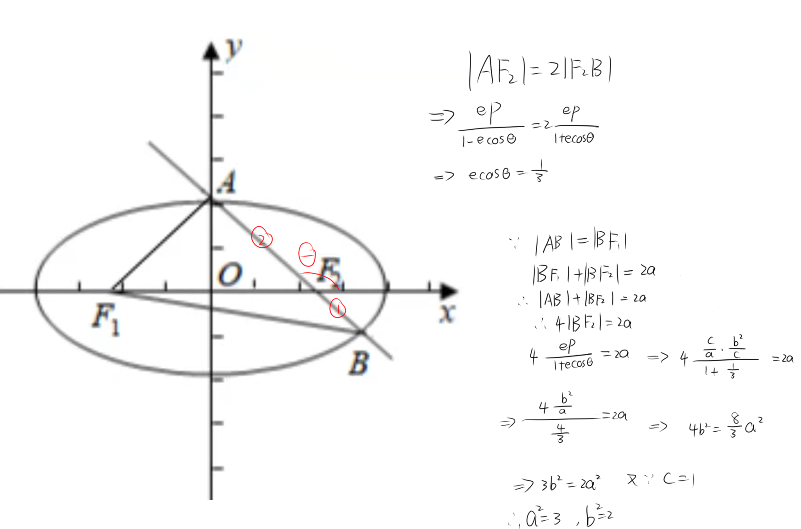

T3

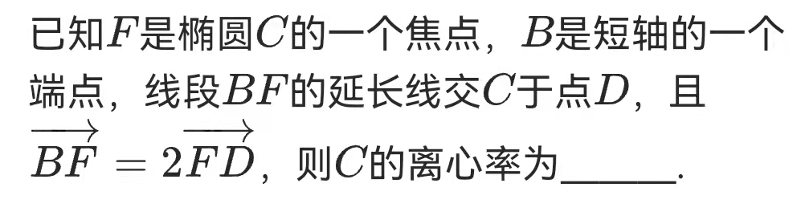

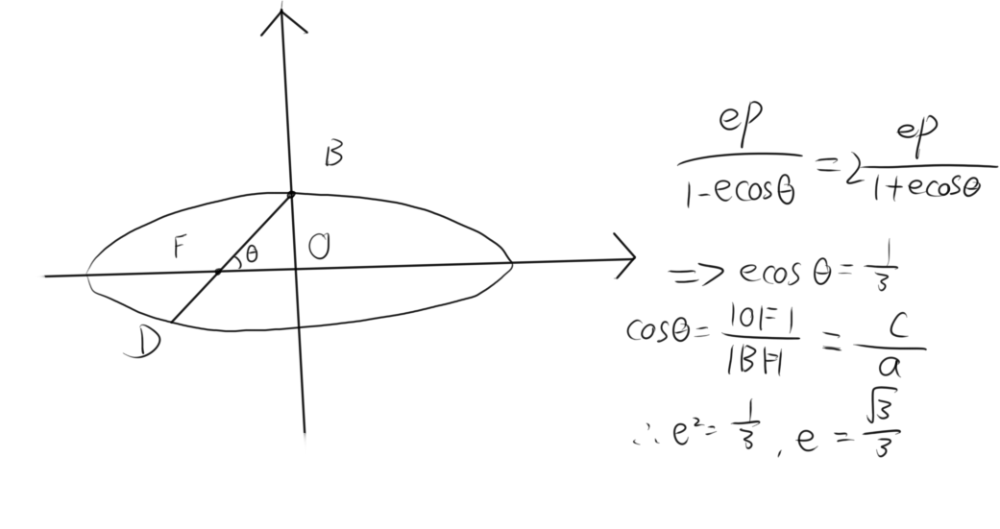

T4

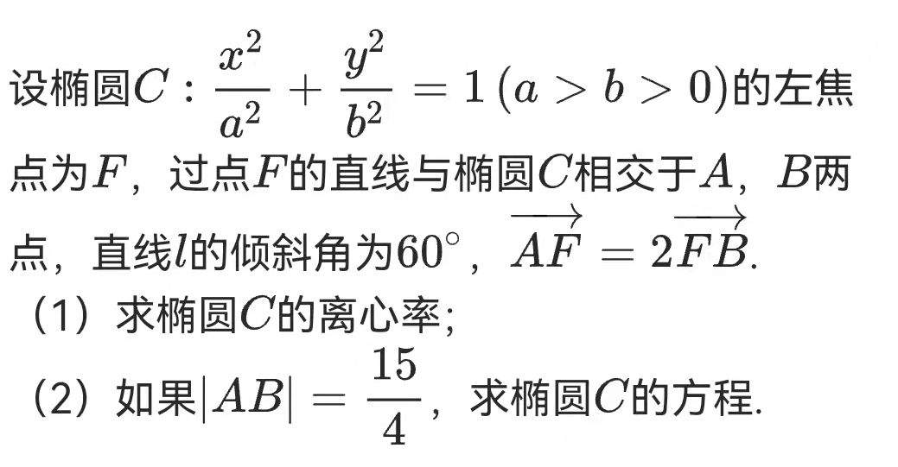

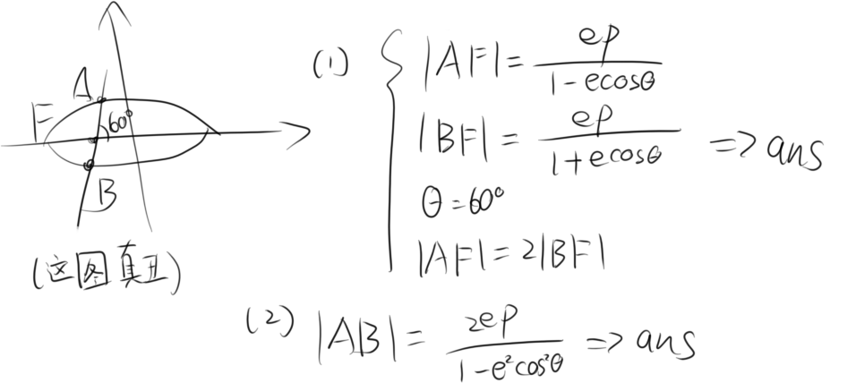

T5

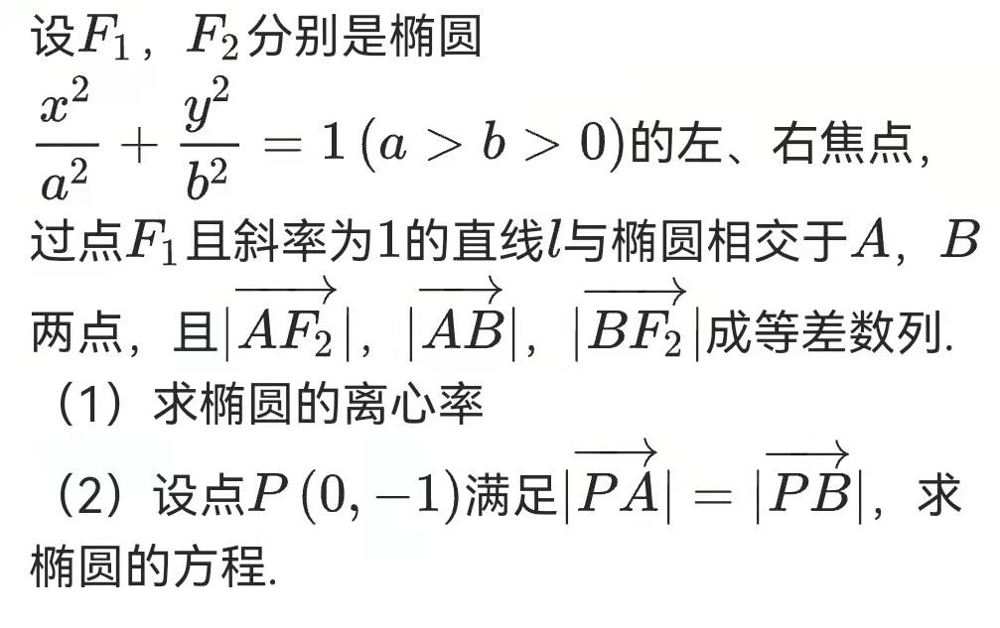

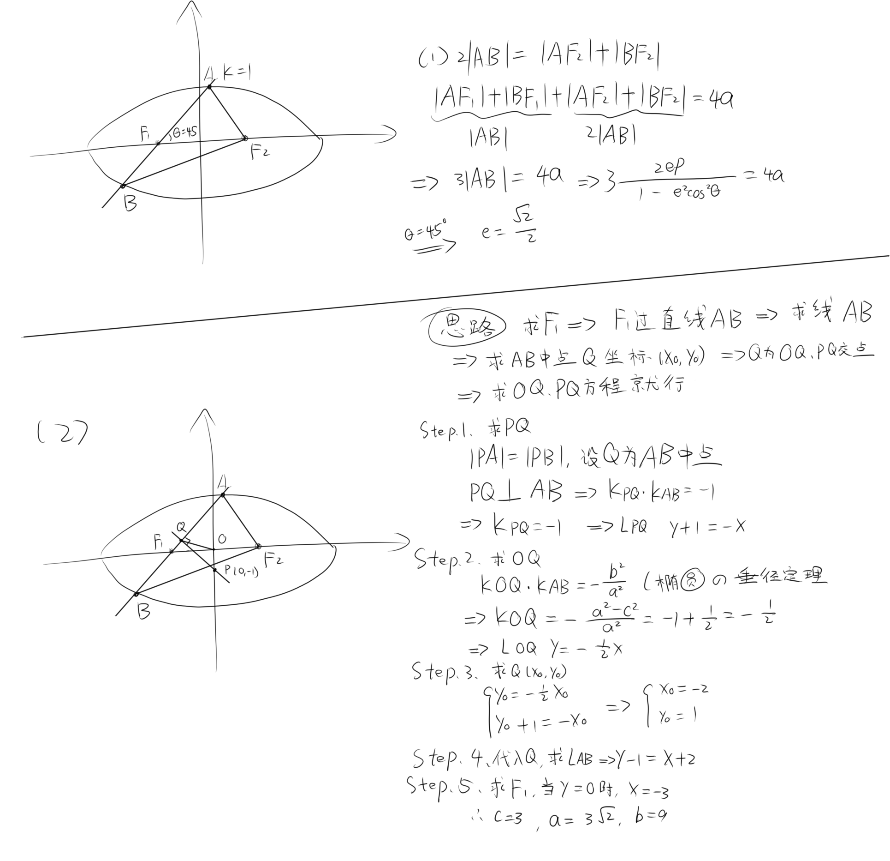

T6

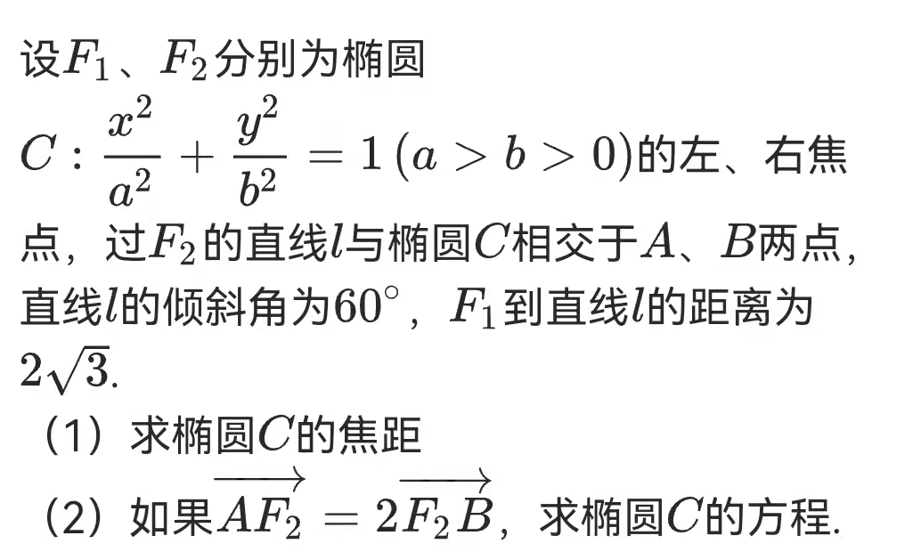

这题，水题，如果你不会那只能说明一个问题，就是你不会

T7

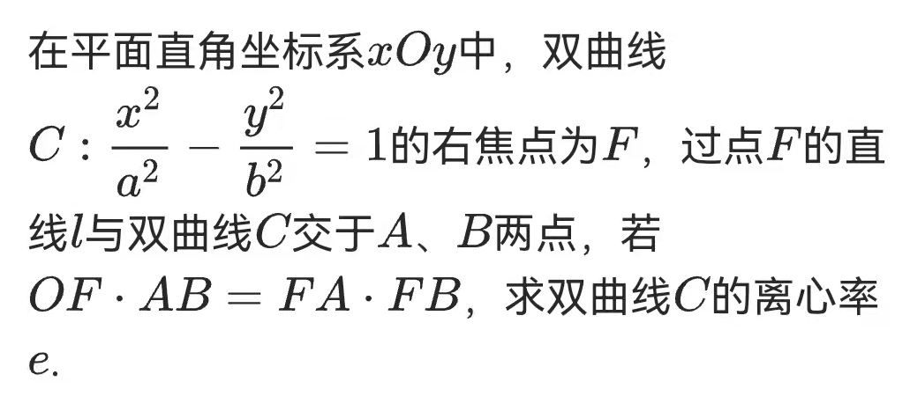

T8

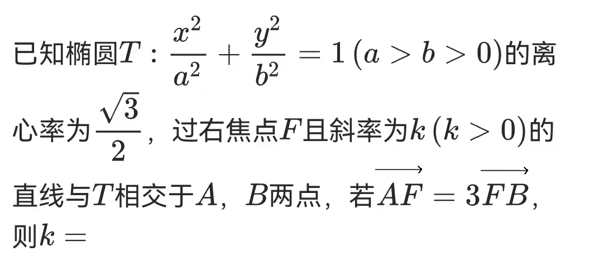

T9

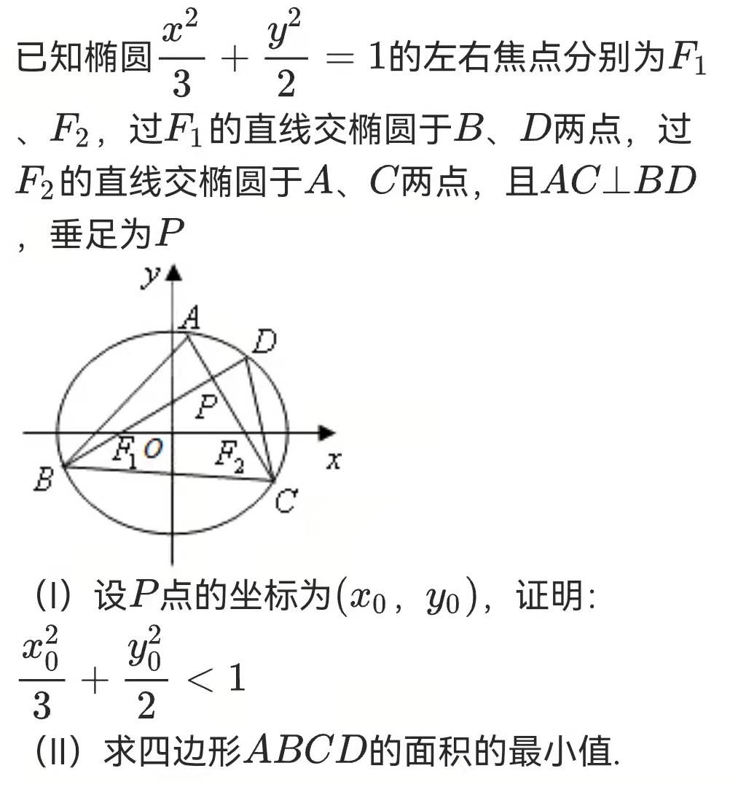

T10

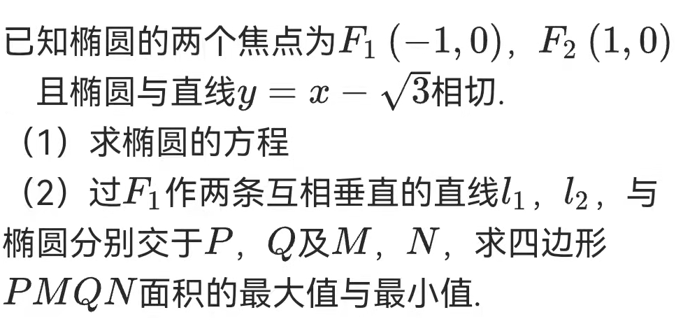

T11

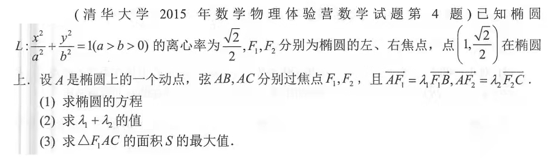
