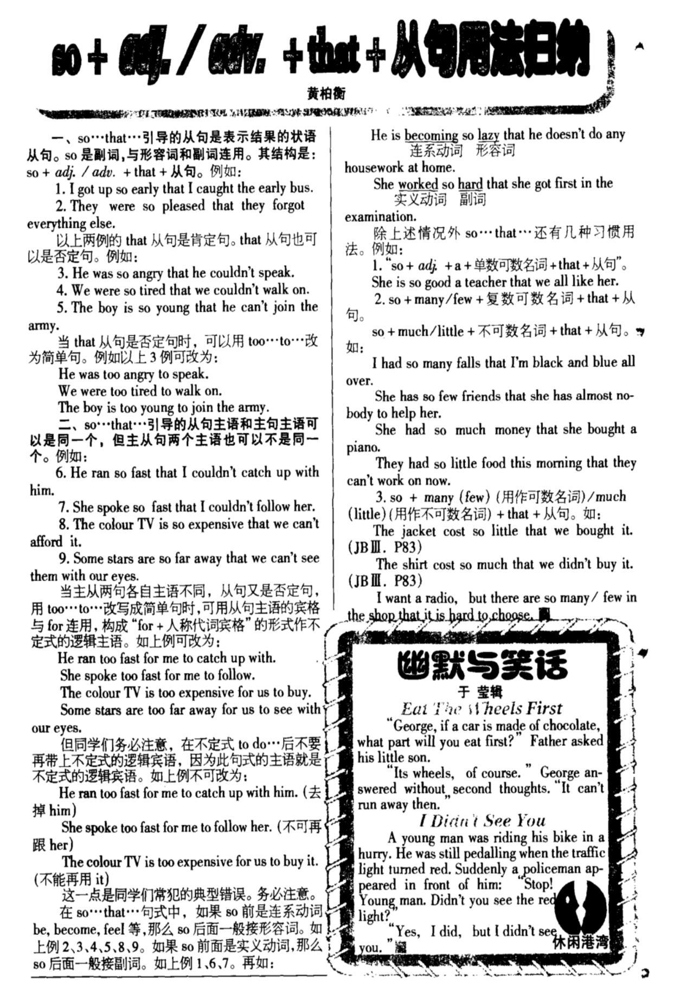

# 小作文&大作文句型

# 大作文

## Hardly ~ when ~

该句型的基本用法为：主语 + had hardly done ~ when + 主语 + did ~

使用时要注意  
1、该句型所描述的动作一般都发生在过去  
2、主句谓语动词采用过去完成时，when从句的谓语动词采用一般过去时  
3、hardly可以替换为scarcely或rarely

Eg. She had hardly had time to sit and have a rest when the phone rang again.  
她刚想坐下来休息一会儿，电话又响了

**需要注意的是，有的时候，否定副词hardly、scarcely或rarely可以提到句首，但这时会引起倒装**  

**Hardly had sb done ~ when + 一般过去**  
**某人刚做完某事, 就 ~**

**如上面的句子就可以改为**  
**Eg. Hardly had she had time to sit and have a rest when the phone rang again.**

## It was/wasn't ~ before ~

**It was + 时间段 + before ~  
过了多久才(怎么样)~**

**It was not + 时间段 + before ~  
没过多长时间就~**

**It was not long before ~  
不久，就~**

举一些栗子↓🌰

It was five days before he came back.  
五天后他才回来

It was six day before we got to the beach.  
六天后我们才到达海滩

## So + adj./adv. that ~ 倒装

### 基础用法见下图↓

### So + adj./adv. 位于句首时的倒装
**副词so后接形容词或副词位于句首时，其后用部分倒装**  

1. So cold was the weather that we had to stay at home.  
天气太冷，我们只好呆在家里
2. So fast does light travel that we can hardly imagine its speed.  
光速很快，我们几乎没法想像它的速度
3. So sudden was the attack that we had no time to escape.  
袭击来得非常突然，我们来不及逃跑

### 具体的两个公式

**So adj. was/were sb that + 一般过去  
某人太 ~ 以至于  
So adv. did sb do sth that + 一般过去  
So quickly did he run that I couldn't catch up with him.**

## as或though引导的让步状语从句倒装

**as或though引导的让步状语从句,可以倒装(although不行),通常把表语(名词或形容词,当名词前带有冠词时,倒装时要删去)，状语(副词)或者动词放在句首**

**提前到句首的词:形容词,名词,副词,动词**

1.Tired as he was , he still work hard.  
2.Child as/though he was,he knew a lot of things.  
3.Much as/though he liked the toy,he would not buy it.  
4.Try as/though he might,he could not open the door.

## The door opened and in came our teacher , with/who/doing ~

## It was the first time that ~ sb had done ~

某人第一次 ~ 

## Seeing the frightening scene , he froze there , not knowing what to do.

分词做状语 + 主句 + 分词作状语

Amazed at what he said , he froze there , not knowing what to say.  

Starting from January 1st , the literature society recommended many good books , uncouraging us to get pleasure out of reading. 

## A , B and C

并列句

## It dawned on sb that ~

某人突然意识到

用于升华

## Whenever/Whatever ~ , ~

不论如何, ~ 

用于说道理, 升华作文

# 小作文

## As scheduled, the activity will be held at 8:00 o'clock on Sunday morning in the lecture hall.

开头状语从句省略 As (the activity is) scheduled

用于写活动地点时间

## 非限定性定语从句

~ , which aims to do ~  
~ , whose aims is to ~  
~ , which is of benefit.  
~ , with the theme of ~  

## 现在分词做状语

~ ranging from ~ to ~

~ including A , B and C.

## Not only can you ~ but also ~
部分倒装

## What matters most is that ~
主从+表从

## There is no denying that ~

## It's a valuable chance for sb. to do sth.
It's 做形式主语

## Some ~ while/others ~
形成对比 

## Anyone/Everyone who ~ can/is/do ~
定语从句

## Only with joint efforts can we solve the problem.

Only + 状语提前 用部分倒装
