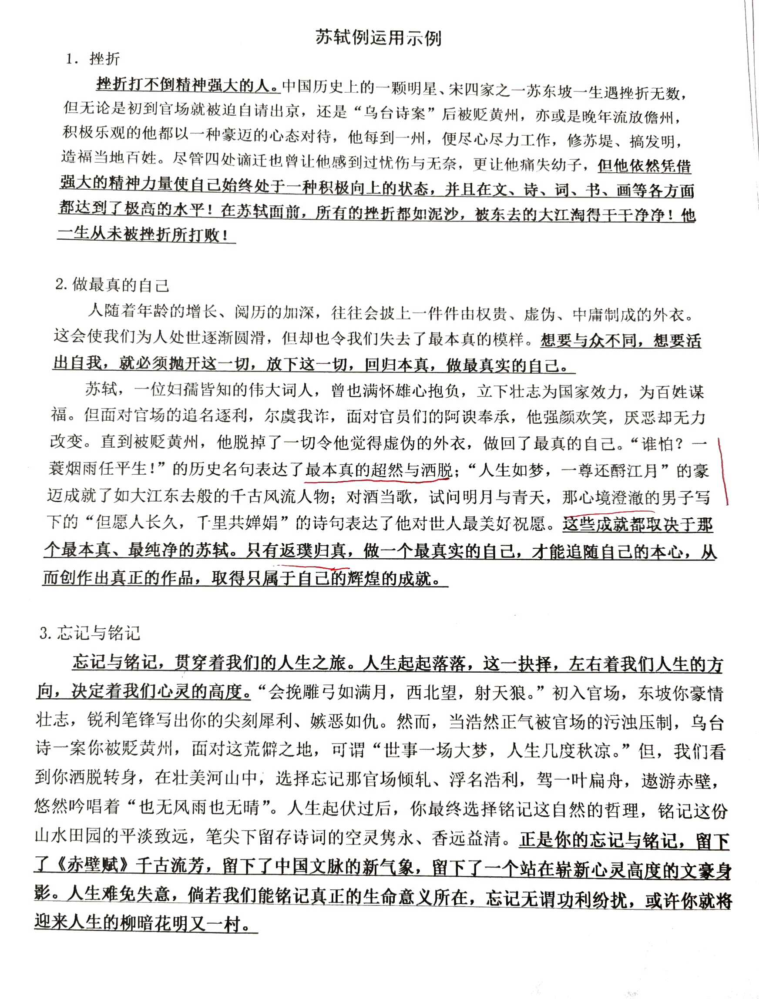
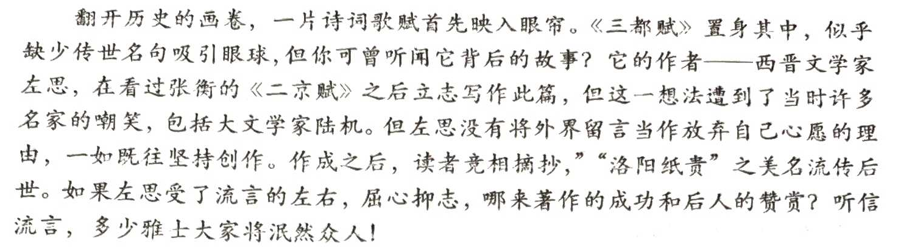

# 苏轼

**卜算子·黄州定慧院寓居作**
**缺月挂疏桐，漏断人初静。谁见幽人独往来，缥缈孤鸿影。**
**惊起却回头，有恨无人省。拣尽寒枝不肯栖，寂寞沙洲冷。**

**定风波·莫听穿林打叶声**
**莫听穿林打叶声，何妨吟啸且徐行。竹杖芒鞋轻胜马，谁怕？一蓑烟雨任平生。**
**料峭春风吹酒醒，微冷，山头斜照却相迎。回首向来萧瑟处，归去，也无风雨也无晴。**

**人生如梦，一樽还酹江月**

**但愿人长久，千里共婵娟**

**会挽雕弓如满月，西北望，射天狼**

**《赤壁赋》**

“乌台诗案”，被贬黄州
每到一州，都修苏堤，搞发明，造福当地百姓

# 钱伟长
**物理5分却转系物理，为我国航空航天等事业立下了汗马功劳**
钱伟长出生于一个书香家庭，父亲是位教师，教书育人；四叔是位国学大师，受人敬仰；六叔诗词书法不在话下；八叔则小品、笔记杂文信手拈来。这样的家学渊源使得钱伟长精通国学和历史。高考时，他的语文和历史获得了满分，然而你能想到语文加历史的成绩就已经200分，但钱伟长的总成绩竟然才225.那宝贵的25分是怎么来的呢？化学和数学一共20分，物理5分，英语0分。从未接触过英语的钱伟长，英语考了0分倒也不算过分，但理科一共考了20分也算是惊为天人了。然而由于文史成绩实在是太过突出，清华大学历史系依旧破格录取了钱伟长。

结果在刚进入清华大学历史系的第二天，钱伟长就想转系学习物理。这到底是怎么回事呢？原来钱伟长在收音机里听到了日本在东北发动了“九一八事变”的消息，强烈的爱国之情让他对这些入侵者十分不满，也让他燃起了要为中国“制造飞机大炮”的雄心。他曾说：“国家的需要就是我的专业”。于是他毅然决然弃文从理，跑到当时物理系主任吴有训的办公室，恳求他同意自己转入物理系。

然而转系并没有自己想得那么简单，多得是像他这样的热血青年请求转如物理系。然而怀着激动的心情，排着长队的钱伟长在终于轮到自己申请转系后，却遭到了吴有训的拒绝，毕竟5分的物理成绩想进入物理系，一般人都会觉得是在开玩笑。然而钱伟长却不曾放弃这个想法，在钱伟长每天的死缠烂打、软磨硬泡之后，吴有训拗不过他，终于同意钱伟长先在物理系学习一年。

不过转系是条件的，那就是在这个学年结束时，钱伟长的物理和微积分两门科目必须都要超过70分，并且还要学习化学，加强体育锻炼。钱伟长深知自己学习物理并不是一时兴起，而是真的想为国家制造先进的武器看，抵御敌人的侵略。抱着这个初心，钱伟长夜以继日的刻苦学习，加上吴有训这个良师益友的帮助下，钱伟长成功达到了要求，顺利留在里物理系。

1935年，钱伟长以物理系第一名的成绩顺利从清华大学物理系毕业。

1940年。钱伟长赴加拿大多伦多留学深造，师从辛吉，主攻弹性力学，研究板壳理论。短短50天内，钱伟长完成了论文《弹性板壳的内禀理论》，并发表在了世界导弹之父冯·卡门的60岁祝寿文集内。1942年，钱伟长担任美国加州理工学院喷射推进研究所研究总工程师，并发表了世界上第一篇关于奇异摄动的理论，成为了该领域的奠基人。

此时的他已经功成名就，然而在听到了抗日战争胜利的消息后，他抛下了在美国的大好前途，义无反顾地回到了中国，前往清华大学、燕京大学、北京大学任教。1948年，中国内战，作为教授的生活十分艰难，然而在美国的一位老朋友前来看望他，问他是否愿意回加州理工学院任教时，他拒绝了。他说：“归根结底，我这一生都是一个爱国主义者。”

在那样艰苦的条件下，钱伟长在北京大学创立了中国第一个力学专业，并出版了中国第一本《弹性力学》专著，为中国培养了一大批出色的力学研究领域的标杆人物，为我国的航空航天、机械工业、土木建筑等事业立下了汗马功勋，被后人称之为“力学之父”。

# 苏武
*运用实例*
守住内心，坚定信念，将青春和生命塑成永恒的丰碑。
很难想象，七千多个日日夜夜，苏武，你在贝加尔湖畔怎样孤独的等待。大漠狂沙，是否在有意隔断？大雪封山，是否在有意刁难？鸿雁长飞，是否擦动了你的心弦？李陵功降，是否摧残了你的信念？没有！你的心中只有大汉，只有一个使臣兼壮士应有的爱国情怀与坚贞不屈；你的耳边只有一种声音——一息尚在，我会回来！十九载风霜雨雪谁人解，一朝持节返乡动京华。万人空巷，日月动容。你所赢得的不仅是朝延的嘉奖和封赏，更是一个民族对你永恒的肯定与崇拜。

# 玄奘
*运用实例*
玄装，一个带有神话色彩的名字，取经，一段充满神话故事的征途。他不是神，因为历史上确有其人，确有其事；他是神，因为他做了芸芸众生不能做基
至不敢想的事。
取经路有多难？天知地知，但你可知？你可知，那会是一年年含辛茹苦？你可知，那会是几万里风霜雨雪？你可知，那里纵无妖魔鬼怪，亦有险山恶水？你可知，此去经年，应是鬓添白发，减损韶华？也许你不知，但因为你要把真理妙谛播天下，要让九州处处披锦霞，所以你责无旁贷，义无反顾，但我相信你都知，作为一个有大慈悲之人，为了天下苍生，为了宏图愿景，这些征途上的苦难，又算得了什么？所以，你踏过大漠孤烟，越过雪域高原，翻过昆仑天山，渡过大河急湍，终取得真经，回返华夏，赢得世代传颂是酬答。	
是的，其实你心中早已知道此去干难万险、九死一生，但你看见的，绝不仅是征途的大漠荒原，更是大唐的绿水青山；绝不仅是现在的风雨恩然，更是以后的太平人间，所以，你会永怀希望，勇往直前！

# 马谡 sù
**失街亭**
三国时代的诸葛亮与司马懿在街亭对战，街亭战略地位非常重要，马谡自告奋勇要出兵守街亭，并表示愿立军令状，若失败就处死全家，诸葛亮最终同意，并指派将军王平随行，并交代在安置完营寨后须立刻回报，有事要与王平商量，马谡一一答应。可是军队到了街亭，马谡执意扎兵在山上，完全不听王平的建议，而且没有遵守约定将安营的阵图送回本部。等到司马懿派兵进攻街亭，围兵在山下切断粮食及水的供应，使得马谡兵败如山倒，重要据点街亭失守。事后诸葛亮挥泪斩马谡。临刑前，马谡上书诸葛亮：“丞相待我亲如子，我待丞相敬如父。这次我违背节度，招致兵败，军令难容，丞相将我新首，以诚后人，我罪有应得，死而然。”诸葛亮总结此战失利的教训，痛心地说：“用马谡错矣。

# 莫扎特
**追求艺术造诣而放弃宫廷乐师的职位**
1772年，16岁的莫扎特被任命为萨尔茨堡宫廷乐师，结束了长期的旅行演奏生活。
1781年，脱离对雇主的依赖，成为历史上最早的自由作曲家。

# 华罗庚
在他回顾人生遭遇时，谈到自己的“平生之劫”：第一次劫是15岁到20岁期间，贫病交加，但每天废寝忘食，苦攻数学，自学有成，路进了数学王国；第二次劫是抗日战争期间，政治黑暗，民不聊生，仍坚持排难攻坚，著书立说：第三次劫是十年动乱，批斗抄家，但仍冒着风险到各地推广“优选法”，“统筹法”，将数学用于国民经济。

# 李宁
**一代体操王子泪洒汉城黯然退出体坛后，却又开创了自己的事业，让李宁牌系列运动产品风靡中国体育用品市场**

# 左思

# 沈从文

# 钱钟书

# 钱学森

# 庄子

# 刘禹锡
**《陋室铭》**
**山不在高，有仙则名。水不在深，有龙则灵。斯是陋室，惟吾德馨。苔痕上阶绿，草色入帘青。谈笑有鸿儒，往来无白丁。可以调素琴，阅金经。无丝竹之乱耳，无案牍之劳形。南阳诸葛庐，西蜀子云亭。孔子云：何陋之有？**
唐代文学家、哲学家
唐顺宗即位后，刘禹锡参与“永贞革新”
革新失败后，屡遭贬谪，写下《陋室铭》

# 释迦摩尼

# 李白

# 司马迁
**遭受腐刑，却能在这样的耻辱中写成《史记》**

# 苏秦
**战国时期纵横家，以锥刺股**

# 孙敬
**系发悬梁**

# 孙康
**雪映纱窗**

# 车胤 yìn
**囊萤夜读**

# 匡衡
**凿壁借光**

# 李密
**牛角挂书**

# 诺贝尔

# 居里夫人

# 海瑞

# 聊斋志异

# 如果你有两块面包，就要用一块去换一朵水仙花

# 鲍叔和管仲

# 爱因斯坦和玻尔

# 司马光，王安石，苏轼

# 姚明和奥尼尔

# 雷军和董明珠
