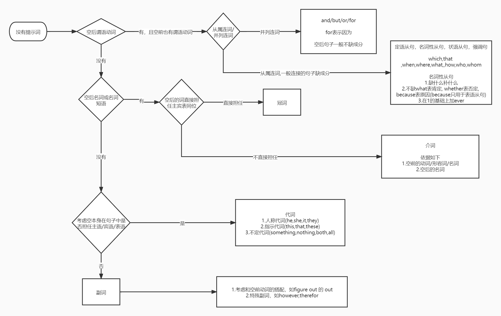

# (名词)
## 1.变复数
## 2.变形容词
+al eg.unconditional,conventional  
+cial eg.facial,beneficial,financial,official  
+tial eg.influential  
+ous eg.adventurous,harmonious  
+ful  
+tic eg.energetic  
+tical eg.political  
+en eg.wooden,woolen  
+ed eg.spotted  
## 3.变名词所有格
## 4.变反义词
eg.misfortune,disbelief
## 5.变动词
eg.encourage,endanger,strengthen,lengthen,heighten,frighten
# (动词)
## 先翻译看是不是动作
## 1.不词性转换
### ①考虑此句缺不缺动词
### ②若缺动词考虑时态和语态
现在完成时间状语  
So far/ up to now/ till now/ by now/ since/ ever since/ since+点时间/ since then/ for+段时间/ in recent years / in these days / lately/ in the last five years / over the past five years  

一些过去的时间状语  
a few days ago(一般过去)/ a few days before(过去完成)/ a few days earlier(过去完成)/a few days later(看情况)

一些题↓  
It is two years since he _came_ ( come ) back.  
It will be two years before he _comes_ ( come ) back.  
It was two years before he _came_ (come) back.  
It is the first time that he _has been_ (be)to Beijing.  
It was the first time that he _had been_ (be) to Beijing.  
It is high time that he _went/should do_ (go)there at once.  
hardly...(过去完成)...when (一般过去)  
no sooner... (过去完成)..than (一般过去)  

### ③若不缺动词考虑非谓语动词
doing / done  / to do / 和 having done /  having been done/ being done/ to be done

出现for a long time / twice / 动作明显先后  
用现在分词完成式 having done / having been done

出现now / at the moment  
用被动进行 being done
eg.The qusetion being discussed now / at the moment is interesting.

出现将来的时装
用to be done 表将来

一些题型↓

## 有and并列句，填谓语 ##
_Compare_ (compare) these books ,and you’ll know the difference.

## 分词做状语，看所填词与主句主语关系 ##
_Comparing_ (compare) these books, you’ll know the difference.  
_Compared_(compare) with this book, that book is better.  
_Followed_ (follow) by many students, he entered the classroom.  
His mother rushed out, _leaving_(leave) him crying.  
## “，”之后，99%填现分，1%填过分,to do永远不填 ##
_Warned_ (warn) of bad weather, he still went out.

## 空前名词，分词做后置定语 ##
及物动词 动宾关系 seat sb 用过去分词
The boy _seated_ (seat) under the tree is Tom.
不及物动词 主谓关系 sb sit 用现在分词
The boy _sitting_ (sit) under the tree is Tom.

## 前置定语 ## 
He said in an _excited_ (excite) voice that the news made him _excited_ (excite).  
When I arrived, I found him _locked_(lock) in the classroom.  
不能用being locked ，因为被动进行表动作,而这个题是表状态

### ④介词后注意名词与动名词 
the way of _success_ ( succeed ).  
~ of _competition_ ( compete ).  
~ of _competing_( compete ) with others.  
带着宾语,填动名词形式  

## 2.v.→adj.
## 3.v.→n.
# (形容词)
考虑变形
# (代词)
考虑反身代词
# 无提示

https://vexpaer.github.io/2021/10/26/语法填空没有提示/

## 并列句&状从
空的两端是不缺成分的句子考虑并列句(and/but)和状语从句(unless/if/when/while/as/so----that  such----that)  
如果 完整句子,____完整句子 那么大概率是填and/but

## 定从6公式
名词  ____________  缺成分句子 填that  
名词  ____________  不缺 填when/where/why  
名词 ,  ____________  缺 填which/who/whom/whose  
名词 ,  ____________  不缺 填when/where  
名词 + 介词  ____________ 填which/whom.whose  
____________ 缺，不缺 非限制定从，只能填As  

## 语法填空没有提示

