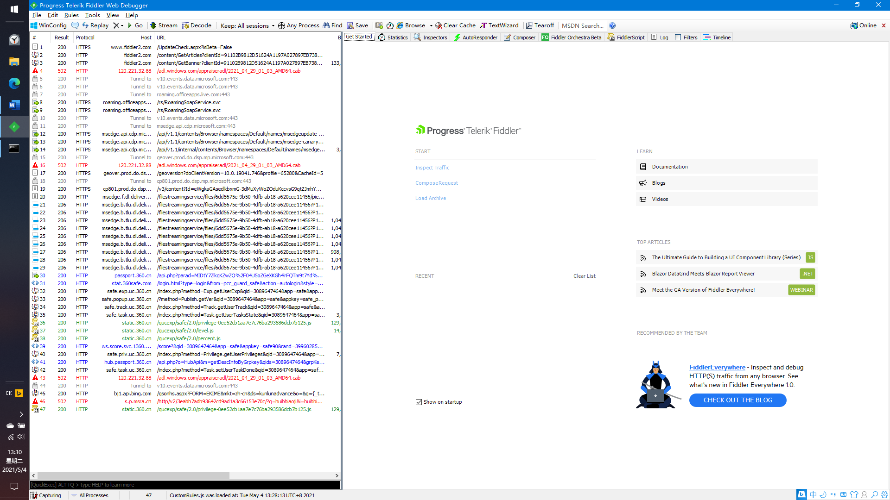
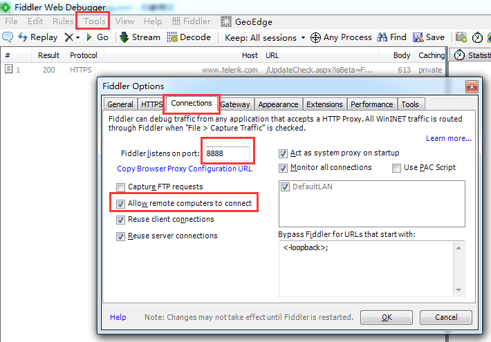
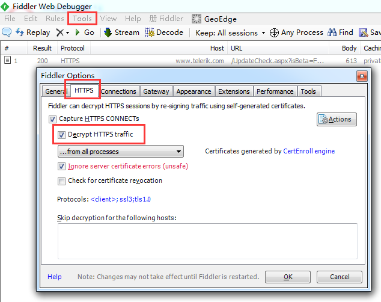
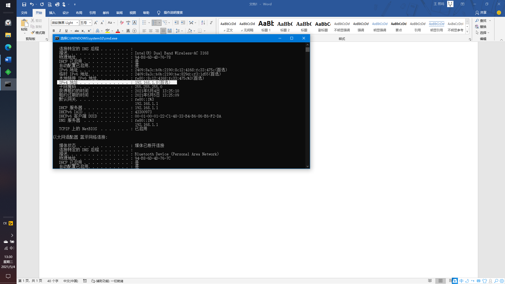
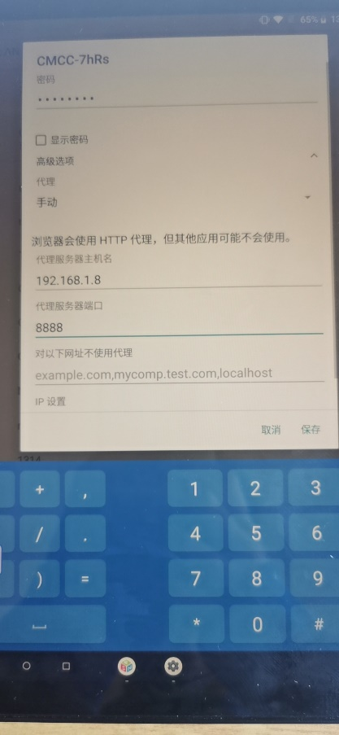
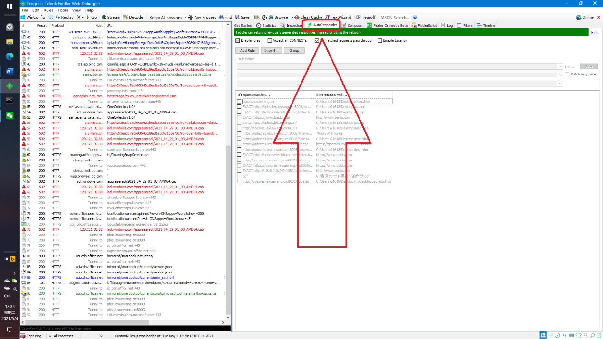
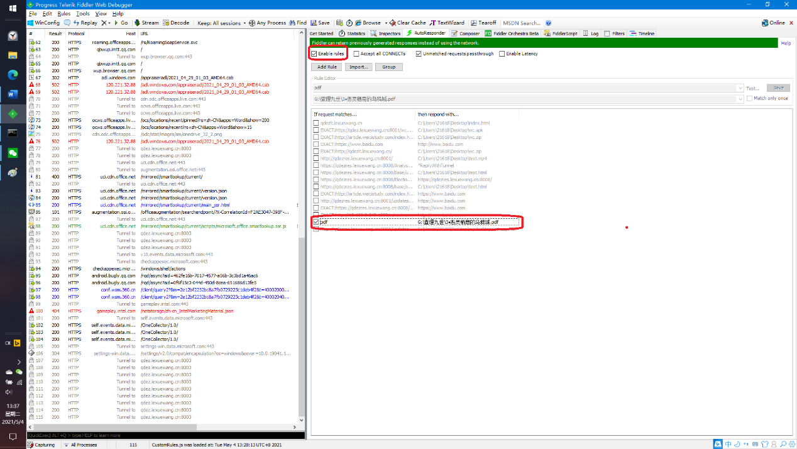
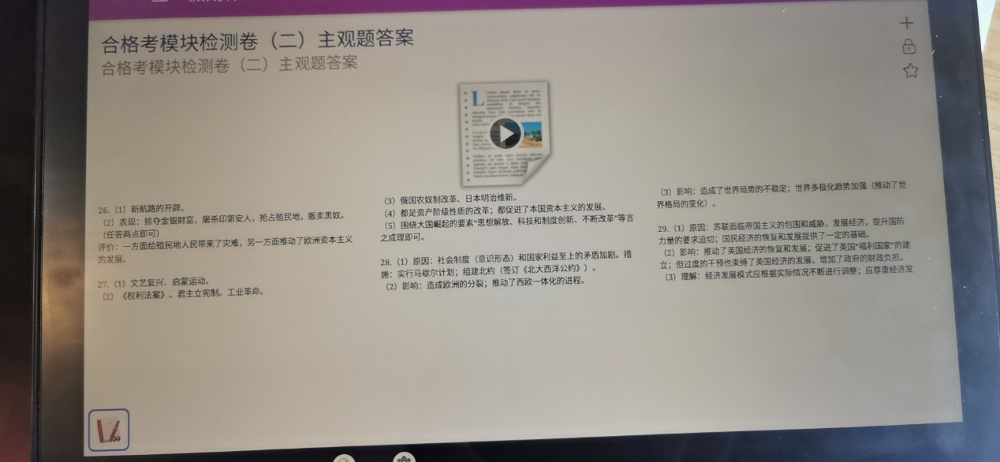
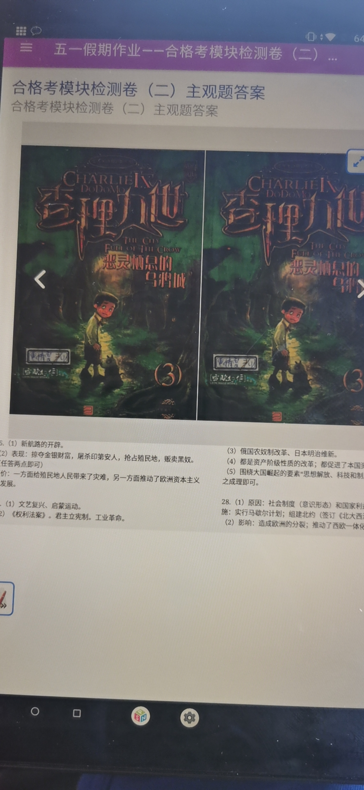
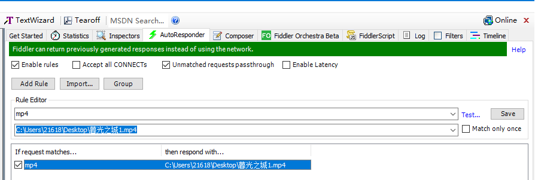

Pad 抓包：从入门到精通

Vexpaer

1.  电脑上下一个fiddler，打开之后是这个样子

**第一次使用fiddler需要进行配置，以后就不用了**

配置fiddler

① Tools-\>Fiddler Options-\>Connections

说明：1.Fiddler listens on port是手机连接fiddler时的代理端口号，默认8888即可

2.Allow remote computers to connect是允许远程发送请求，需要勾上

② Tools-\>Fiddler Options-\>HTTPS

2.  查看电脑IPv4码（自行百度

3.  pad上网络长按点修改网络→高级选项→代理→手动，然后代理服务器主机名写第二步的IPv4地址（我这里是192.168.1.8，每个电脑IPv4地址不一样需要自己查看），端口写8888，输密码，点确定。**这里注意pad要和电脑连一个网**

4.  回到电脑上的fiddler，点auto responder(自动回复)→add
    rule(添加规则)，上面一行写pdf，下面一行写自己要导入文件的pdf地址

然后点保存，勾选，上面勾选enable rules

5.  回到pad上随便找个文件打开**（这个文件要没下载过**

6.  完事

说明：只讲了最简单的步骤没有讲任何原理，可百度自学，不行的话欢迎找我Q2161884681

Extra

补充：mp4文件导入

操作流程与上面前三步一样，第四步中pdf改成mp4，文件改成一个mp4文件，如图为例

之后翻到课堂实录里面找一个打开，点击下载当前视频（需要以前没有下载过

等亿小会，就好了

芜湖
